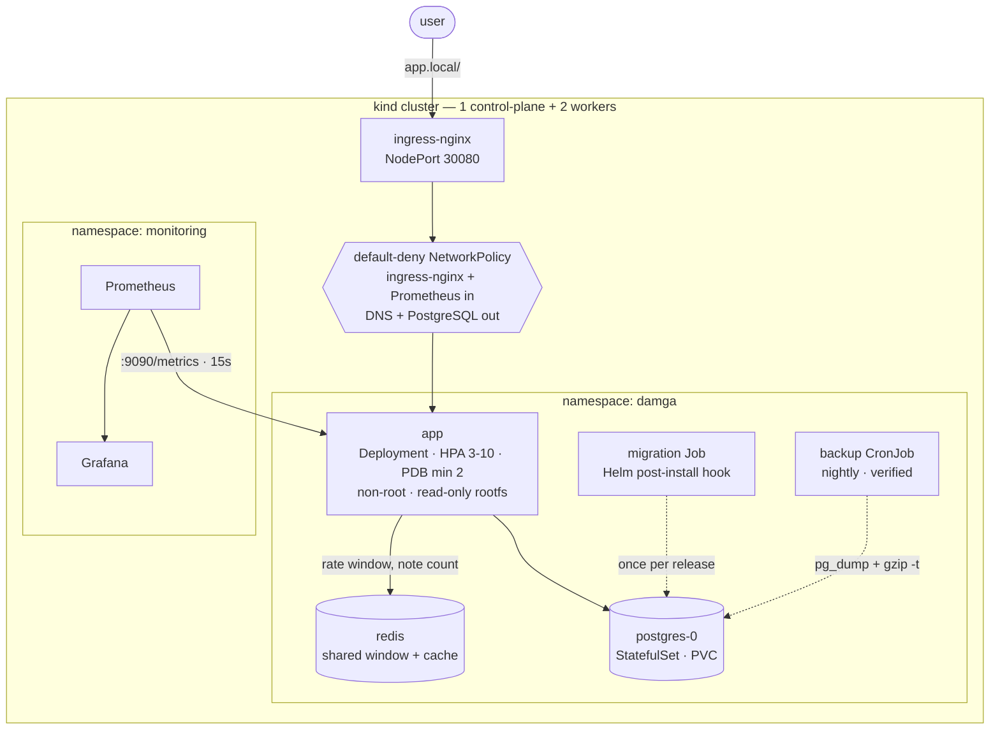

# Damga

[](https://github.com/damgahq/damga/actions/workflows/ci.yml)
[](LICENSE)


**Damga is a Kubernetes application platform, built in the open.** *Damga* is
Turkish for a seal — the mark that says a thing is genuine, and says who put it
there. That is the whole idea: a deploy should be able to prove itself. Which
commit, which signature, which policies passed, when the backup was last
checked.

**What is here today is the foundation, not the product.** A `Workload` custom
resource and the operator that renders it into a Deployment, Service, Ingress,
HorizontalPodAutoscaler, PodDisruptionBudget and NetworkPolicy — with no field
that turns the hardening off, because none is defined. Admission policies the
API server enforces, each with a test proving it rejects what it should. Images
signed with keyless cosign and verified at admission rather than at build time.
Nightly backups, checked for readability. The release reconciled from git by
Argo CD.

Running alongside it is a Node.js + PostgreSQL service: non-root containers on
a read-only root filesystem, default-deny network policies, a schema migration
that runs once per release, autoscaling, disruption budgets and Prometheus
metrics. It is not the product. It is the tenant everything else is measured
against, and it is what makes the numbers below real — zero-downtime upgrades,
network isolation, rate limits that bind across replicas, all exercised on a
real cluster on every push.

**Not here yet:** a user interface, multi-tenancy, an installer, or any way to
deploy an application without knowing Kubernetes. That is the product. This is
what it gets built on.

Every number in this README was measured on the cluster this repository builds.
The bugs found along the way are written up where the mechanism they broke is
explained, rather than collected in one place. Turkish readme:
[README.tr.md](README.tr.md).

```
Kubernetes 1.36 · kind · Helm 3 · containerd · ingress-nginx · Prometheus · Grafana · GitHub Actions
```

---

## Architecture



---

## Quick start

Requires Docker, [kind](https://kind.sigs.k8s.io/), kubectl, Helm, Terraform and jq.
The operator targets below also need Go; the operator's own Makefile fetches
controller-gen and kustomize itself.

```bash
git clone https://github.com/damgahq/damga.git && cd damga
make up                                    # cluster + ingress + build + deploy
echo "127.0.0.1 app.local" | sudo tee -a /etc/hosts
curl http://app.local:8080/stats           # the service
make smoke                                 # 30 end-to-end checks
```

That brings up the cluster and the sample workload. The control plane — the
panel, the API and the evidence store — runs on its own and needs no cluster:

```bash
go build -o damga ./cmd/damga
./damga bootstrap -evidence-dsn ./damga.db -email you@example.com -tenant acme
./damga -evidence-dsn ./damga.db -listen-address 127.0.0.1:8080
```

`bootstrap` prints a password once. See [CONTROL-PLANE.md](CONTROL-PLANE.md)
for the flags that are easy to get wrong, what is on the API, and what is not
built yet.

## The service

`http://app.local:8080` is a working notes API. Every response carries the
identity of the replica that produced it, so a handful of requests is enough to
watch the load spread across replicas.

That identity deliberately does **not** come from the Kubernetes API. Reading it
from there would mean mounting a service-account token into a pod that has no
other reason to hold one. It comes from the downward API instead — environment
variables the kubelet injects.

| Command | What it does |
|---|---|
| `make test` | Unit and integration tests (29 tests, no cluster needed) |
| `make lint` | ESLint + `helm lint` + renders every values profile |
| `make deploy` | Rebuild the image and upgrade the release |
| `make smoke` | End-to-end checks against the running deployment |
| `make policies` | Apply the admission policies |
| `make policy-test` | Prove each policy rejects what it is supposed to |
| `make alert-test` | Break the service and prove the alert reaches Alertmanager |
| `make report-test` | Prove policy results reach a report, failures included |
| `make operator-test` | The operator's unit and envtest suites |
| `make operator-install` | Install the Workload CRD into the current cluster |
| `make operator-deploy` | Build the operator, load it into kind and deploy it |
| `make tls` | Install cert-manager and serve HTTPS from a local CA |
| `make logging` | Install Loki and Alloy, and wire Loki into Grafana |
| `make gitops` | Install Argo CD and let it reconcile the release from git |
| `make platform` | Apply the platform layer with Terraform |
| `make platform-plan` | Show what Terraform would change, without changing it |
| `make monitoring` | Install Prometheus, Grafana and Alertmanager |
| `make down` | Delete the cluster |

---

## The Workload API

The service above is deployed by the Helm chart — the long way, written out by
hand. The product path is shorter. A `Workload` is the whole input:

```yaml
apiVersion: platform.damga.co/v1alpha1
kind: Workload
metadata:
  name: notes
  namespace: damga
spec:
  image: ghcr.io/damgahq/damga:1.0.0
  port: 3000
  replicas: 2
```

The operator renders that into a ServiceAccount, Deployment, Service,
NetworkPolicy and PodDisruptionBudget, plus a HorizontalPodAutoscaler when
`autoscale` is set and an Ingress when `domain` is. What it renders is not
negotiable: UID 1000, a read-only root filesystem, every capability dropped, no
service-account token, a default-deny NetworkPolicy that also blocks the cloud
metadata range, and a rollout that never removes a replica before its
replacement is ready.

Those are not defaults. No field turns any of them off, because none is defined
in the CRD.

```bash
make policies                              # the labelled namespace and the rules
make operator-install                      # the CRD
make operator-deploy                       # the controller
kubectl apply -k config/samples/           # a Workload
kubectl -n damga wait --for=condition=Ready workload/workload-sample
```

The namespace matters. All three admission policies bind to
`damga.co/policies: enforced`, and so does the image signature rule. A namespace
without that label is not a namespace with weaker rules — it is one with no
rules at all, and nothing says so.

Two labels grant exceptions, and neither can be granted by a workload to itself:
`damga.co/api-access: permitted` lets a pod that also asks keep its service
account token, and `damga.co/unsigned-images: permitted` admits the locally
built `damga-*` images that `make up` produces. The second exists because an
unsigned image is one no signature rule can evaluate, and admitting it silently
made *never checked* look exactly like *verified*.

---

## What this demonstrates

### Security

| Control | Where | Verified by |
|---|---|---|
| Runs as uid 1000, never root | `podSecurityContext.runAsNonRoot` | smoke test reads `id -u` from the live pod |
| Read-only root filesystem | `containerSecurityContext` + `emptyDir` for `/tmp` | container starts under `--read-only` in CI |
| All Linux capabilities dropped | `capabilities.drop: [ALL]` | asserted against the running pod spec |
| No privilege escalation, seccomp `RuntimeDefault` | pod and container security context | rendered manifests validated by kubeconform |
| No service-account token mounted | `automountServiceAccountToken: false` | the service never calls the Kubernetes API |
| Scrape endpoint is not publicly routable | metrics on a separate port (9090) | CI asserts `/metrics` returns 404 |
| Default-deny networking | 4 NetworkPolicies | an unauthorized pod is proven unable to reach the app |
| Multi-stage image, production deps only | `app/Dockerfile` | Trivy blocks CRITICAL/HIGH findings in CI |
| npm removed from the runtime image | `app/Dockerfile` | eliminated **every** Node.js package CVE (see below) |
| No secrets in git | `.gitignore` + chart values | password is a required chart value |
| TLS, the redirect and the Secure cookie | cert-manager + explicit Certificate | verified on every push against a certificate a real CA issued |
| Security settings are enforced, not just set | Pod Security Admission + ValidatingAdmissionPolicy | 15 policy tests: three compliant manifests admitted, twelve broken ones each rejected |
| Notes isolated per visitor | anonymous cookie, owner-scoped queries | a second visitor cannot read or delete the first one's notes |
| Writes bounded | ingress `limit-rps` + a shared window + a note cap | oversized and over-quota writes are rejected |
| Rate limits bind across replicas | Redis sliding window | 60 requests against a limit of 30: **29 allowed** shared, **60 allowed** per replica |
| Nothing kept forever | hourly retention CronJob | notes older than 24h are deleted |

The egress policy explicitly allows DNS. Forgetting that rule is the most common
way a default-deny policy silently breaks an application: name resolution fails
and every outbound call times out with no obvious cause.

### Enforcement

The chart sets a careful security context on every workload. Until recently
nothing stopped a careless one from being deployed next to it — the settings
were a convention, not a rule.

Two layers close that, both built into Kubernetes:

- **Pod Security Admission** at `restricted` on the namespace: no root, no
  privilege escalation, no capabilities, no host namespaces, no hostPath, seccomp
  required. Everything here already passed it, including PostgreSQL and every
  hook Job.
- **ValidatingAdmissionPolicy** for what PSA has no opinion about: resource
  requests and limits, pinned image tags, a registry allowlist, read-only root
  filesystems, no service-account tokens, and probes on anything long-running.

Turning them on found two real gaps in this repository on the first apply: the
PostgreSQL StatefulSet was not disabling its service-account token, and none of
the migration or backup Jobs had resource bounds. Both are fixed; the policies
are what would have caught them earlier.

These began as Kyverno policies and were rewritten. Kyverno had deprecated the
API in question, and every rule turned out to be expressible in the built-in
engine, which runs in the API server:

| | Kyverno | ValidatingAdmissionPolicy |
|---|---|---|
| Pods to run | 3 | 0 |
| Memory, measured | 174 Mi | none |
| API status | `ClusterPolicy` deprecated | GA since 1.30 |

A policy engine earns its keep for mutation, cross-namespace generation, or
image signature verification. Kyverno is back for one of those — see
[Supply chain](#supply-chain) below and [policies/README.md](policies/README.md).

It is also back for something the table above does not price. A
`ValidatingAdmissionPolicy` decides and forgets: its `.status` records nothing
about any resource it judged, and the `Audit` action on its binding writes into
the API server's audit log, which this cluster does not configure. Moving the
rules into the API server therefore reclaimed the pods in that table and gave
up every answer to *which workloads satisfy them* — leaving only the rejection
at the moment one did not. Kyverno's reports controller reads native policies it does
not own and writes their results as `PolicyReport`s, which is the third pod and
the only in-cluster answer:

```console
$ kubectl get policyreports -A -o json | jq -r '.items[].results[]
    | select(.source=="ValidatingAdmissionPolicy") | [.policy,.result,.severity] | @tsv'
damga-image-provenance   pass  high
damga-resource-bounds    pass  medium
damga-workload-hygiene   pass  medium
```

`make report-test` proves that path, and proves the part a passing cluster
cannot show: it puts a deployment with no resource bounds into a namespace the
bindings do not select yet, then labels the namespace, because a rule that says
`Deny` never lets a violation exist long enough to be reported.

### Supply chain

Everything above answers *is this workload configured safely*. None of it answers
*is this the image we built*. A registry credential, a compromised action, or a
moved tag all produce a pod that passes every policy on this page.

The pipeline signs each published image with keyless cosign — no key to store,
rotate or leak. It exchanges the workflow's OIDC token for a short-lived Fulcio
certificate and records the signature in the Rekor transparency log, so what is
verified later is not "someone held the key" but "this workflow, in this
repository, produced this digest".

The cluster refuses anything else. Kyverno's `verifyImages` is the one rule the
built-in engine cannot express, because checking a signature means reaching a
registry and a transparency log — work an admission plugin does not do. It is
the reason Kyverno was installed, though no longer the only one:

```yaml
attestors:
  - entries:
      - keyless:
          subject: "https://github.com/damgahq/damga/*"
          issuer:  "https://token.actions.githubusercontent.com"
mutateDigest: true      # the tag is rewritten to the digest that was verified
```

`mutateDigest` is what closes the gap between verification and execution. Without
it a tag is checked and then resolved again at pull time, and those are not
guaranteed to be the same image.

| | |
|---|---|
| Signed image | admitted, and rewritten to `…@sha256:…` in the pod spec |
| Unsigned image published beside the release | rejected: **`no signatures found`** |

The negative case deliberately uses an image that *exists* and carries no
signature: `…/damga:unsigned-fixture`, which the publish job builds and pushes
after the signing step and never signs. A tag that was never pushed would be
rejected too — with `manifest unknown`, a different failure wearing the same
colour.

**cosign 3 and Kyverno do not agree yet.** cosign 3 writes signatures as a
Sigstore bundle (`application/vnd.dev.sigstore.bundle.v0.3+json`) and gives no
way to opt out. Kyverno cannot read that layer, and what it reports is not
"unsupported format" but **`no signatures found`** — a valid signature the
enforcer cannot see, indistinguishable from no signature at all. So the signer
is pinned to cosign 2.x until the verifier catches up. An upgrade of the signing
action alone was enough to break enforcement, and the pipeline stayed green
while it did, because the check was reading an image signed before the upgrade.

**The bug this found.** The pipeline signed each image's index digest. A
multi-arch tag is an index pointing at one manifest per platform, and an
admission controller resolves the tag to the child for its own platform — then
looks for a signature on *that* digest and finds none. Verified afterwards:

```
index  sha256:dcda008f…  signed
  ├─ linux/amd64  sha256:4ca43c01…  unsigned
  └─ linux/arm64  sha256:a993151c…  unsigned
```

So a correctly signed image was rejected by a correctly working policy. The CI
check missed it for the reason such checks usually do: it verified the same
digest the previous step had just signed, which is a test that cannot fail for
the reason it exists. `cosign sign --recursive` signs the children too, and the
check now verifies every platform a cluster could resolve to.

### TLS

cert-manager issues the certificate; the chart creates the `Certificate` and
the Ingress consumes the secret it produces.

It would have been easy to prepare this and never run it — a public
deployment needs a domain, and there is no domain. So CI issues a real
certificate from a local certificate authority instead, and checks the whole
path on every push:

| | |
|---|---|
| `https://…/healthz` | 200, certificate issued by the expected CA |
| `http://…/healthz` | **308** — redirected, never served |
| `Set-Cookie` | carries `Secure` |

The only difference from a public deployment is who signed the certificate.
The `Certificate` resource, the secret, the nginx TLS listener, the redirect
and the cookie flag are the same objects doing the same work. Switching to
Let's Encrypt is one value: `--set ingress.tls.clusterIssuer=letsencrypt-prod`.

The `Certificate` is created by the chart rather than by cert-manager's Ingress
annotation. That started when two Ingress objects shared one hostname and one
secret: with the annotation, cert-manager makes the first Ingress the owner and
then refuses to act for the second.

```
certificate resource is not owned by this object.
refusing to update non-owned certificate resource
```

It worked until the owning Ingress was deleted, at which point the certificate
was garbage-collected and the other Ingress quietly lost it. There is one
Ingress now, but the `Certificate` stayed: owned by the release, its lifecycle
does not depend on any Ingress, and the key algorithm, the rotation policy and
the renewal window are chart values rather than annotations.

Locally: `make tls`, then `https://localhost:8443`. The browser warns, because
the CA is local — that is the one thing that is not real.

### Logs

The application logs what someone would act on, not every request:

| Outcome | Level |
|---|---|
| 5xx | `error` |
| 4xx | `warn` |
| 2xx slower than 250 ms | `warn`, with the duration |
| everything else | `debug`, so it is off in production |

A line per healthy request is noise that costs money to store and buries the
lines that matter. A service that logs nothing leaves an operator with no way
to explain a metric. This is the middle.

Measured after five 404s, one 400 and six successful requests:

```
level=info    15   (startup)
level=warn     5   (the 404s and the 400)
level=error    0
successful requests logged   0
```

And the pivot the label scheme exists for — Prometheus names the pod, Loki is
queried with the same name:

```
promql:  topk(1, sum by (pod) (http_requests_total{status=~"4.."}))
         → app-damga-app-557bc659bb-dpp6p, 4×404 and 1×400

logql:   {namespace="damga", pod="app-damga-app-557bc659bb-dpp6p"}
           | json | level=`warn`
         → warn request rejected POST /notes -> 400 (2.95ms)
```

`make logging` installs it. Loki runs in single-binary mode with filesystem
storage and 72 hours of retention: distributed mode, object storage and caches
exist for clusters ingesting terabytes, and the failure mode of a heavy logging
stack on a small cluster is that it evicts the application it was installed to
observe.

### Deployment

CI and Argo CD do different jobs, and the split is deliberate: **CI proves a
change in a cluster it throws away; Argo CD applies it to one that persists.**

A pipeline that runs `helm upgrade` against a long-lived cluster is correct
right up until someone runs `kubectl` by hand at 2am. After that, git and the
cluster disagree and nothing notices. [`gitops/application.yaml`](gitops/application.yaml)
turns that into an enforced invariant — `prune` removes what left git,
`selfHeal` reverts what changed outside it.

Measured on this cluster:

| What was done by hand | What happened |
|---|---|
| `kubectl scale --replicas=5` (git says 2) | back to 2 in **5 seconds**, `OutOfSync → Synced` logged |
| `kubectl delete deployment` | recreated in **5 seconds** |

The namespace gets its Pod Security Admission labels and the policy opt-in
label from `managedNamespaceMetadata`, so a GitOps-managed release is held to
exactly the rules a hand-deployed one is.

**A permanent OutOfSync that was not drift.** The Application sat at `OutOfSync`
while being perfectly in sync. The API server fills in `apiVersion`, `kind`,
`volumeMode` and a `status` block on StatefulSet `volumeClaimTemplates`, and
none of it can be written in a manifest. A signal that is always red trains
everyone to ignore the one thing GitOps exists to tell you. `volumeMode` is now
stated explicitly, and the three fields the server owns are ignored by jq path
rather than the whole block — so a real change to storage size is still seen.

### The platform, as code

`bootstrap.sh` installed the ingress controller, cert-manager and the policies
with a sequence of `kubectl` and `helm` commands. It worked. What it could not
do was tell you what it had created, take one thing back, or express that
cert-manager has to exist before an issuer does — the ordering lived in the
order of the lines.

[`terraform/`](terraform/) manages that layer now, and `make up` calls it
rather than duplicating it. Cluster creation stays out: it comes from `kind`
locally and from a cloud provider or k3s remotely, so the only thing that
differs between them is `kube_context`.

Two things surfaced while moving a live cluster onto it, both worth knowing
before doing this to something that matters:

**A shell script and a Terraform configuration installing the same components
is two sources of truth.** The releases `bootstrap.sh` had installed from static
manifests could not be imported at all — there was no Helm release to adopt, so
Terraform would have installed a second copy beside them. `bootstrap.sh` now
calls Terraform.

**`kubernetes_manifest` cannot plan against a CRD that does not exist yet.** It
resolves a schema at plan time, so cert-manager's `ClusterIssuer`s and the Argo
CD `Application` stay as plain YAML applied afterwards. The admission policies
do not have the problem: `ValidatingAdmissionPolicy` is a built-in API.

A side effect worth having: the ingress NodePorts are chart values now instead
of a `kubectl patch` applied after install. The patch worked and left nothing
that would put the ports back if the Service were ever recreated.

### Reliability

| Behaviour | Implementation | Measured |
|---|---|---|
| Liveness never depends on the database | `/healthz` is process-only, `/readyz` checks the DB | when PostgreSQL was scaled to 0: **0 restarts**, pods left `Running` but unready; recovered **8s** after the DB returned |
| Graceful shutdown | `SIGTERM` handler closes the server and the pool | pod deletion **30s → 0s** |
| Zero-downtime node drain | PDB + topology spread + `preStop` sleep | without `preStop`: **2 of 200** requests dropped · with it: **0 of 300** |
| Zero-downtime rollout | `maxUnavailable: 0`, readiness gating | 250 requests during an upgrade, **0 failures** |
| Survives a broken release | readiness gating | an `ImagePullBackOff` rollout served **200 requests with 0 failures** |
| Autoscaling | HPA on CPU, asymmetric behaviour | 3→10 pods in **45s**; 10→2 over **~3min** |
| Data survives pod loss | StatefulSet + PVC | pod deleted, IP changed, **same volume, same rows** |
| Backups are verified, not assumed | `pg_dump \| gzip` + `gzip -t` + size check | runs on every install and nightly |

Scale-up is immediate and scale-down is deliberately slow: being late to scale
up costs users, being hasty to scale down causes thrashing.

### Operations

- **Schema migrations run once per release** as a Helm `post-install,post-upgrade`
  hook Job — not in an init container, where concurrent replicas race on DDL locks.
- **Configuration changes roll pods** via a `checksum/config` annotation; without
  it a ConfigMap update is invisible to running containers.
- **Logs are collected and queryable**, not just structured. Loki stores them,
  Grafana Alloy ships them, and the labels are named exactly as the Prometheus
  metrics name them — so a spike on a dashboard and the lines behind it are one
  label apart. Promtail would have been the obvious agent; it reached end of
  life in March 2026, so this uses Alloy.
- **Application metrics**, not just infrastructure ones: `http_requests_total`,
  `http_request_duration_seconds`, `notes_total`, `database_up`.
- **Alerts that actually fire.** `up == 0` does *not* fire when every target
  disappears, because the series stops existing. Measured side by side under
  identical conditions:

  ```
  up{job="app"} == 0        → inactive   (never fires)
  absent(up{job="app"})     → firing     (correct)
  ```

### CI/CD

Eight jobs ([`.github/workflows/ci.yml`](.github/workflows/ci.yml)) — five on
every push, three more on `main`:

| Job | Gate |
|---|---|
| `test` | ESLint and 29 tests for the API |
| `manifests` | `helm lint`, renders all values profiles, kubeconform schema validation, `terraform fmt -check` and `validate`, hadolint on every Dockerfile |
| `image` | Builds each image, asserts each is non-root, boots the API image read-only, Trivy scan (fails on CRITICAL/HIGH) |
| `operator` | The Go suite, plus a check that the committed generated code matches what the types produce |
| `e2e` | Creates a real kind cluster, applies the policies **before** the chart so the release has to satisfy them, runs the 13 policy checks that need no Kyverno and the 30-check smoke test, proves an upgrade drops zero requests, then deploys the operator and takes a `Workload` to Ready through admission |
| `build` · `publish` | Builds each architecture natively, pushes to GHCR with SBOM and provenance attestation, signs with keyless cosign (main only) |
| `supply-chain` | Installs Kyverno in a fresh cluster and proves the image this run signed is admitted while a deliberately unsigned one published beside it is rejected (main only) |

---

## Layout

```
app/                  Node.js service
  src/                config · logger · metrics · db · redis · ratelimit · visitor · app · index
  test/               unit and integration tests (node:test, no framework)
  Dockerfile          multi-stage, pinned base, non-root
chart/                Helm chart — the single deployment path
  templates/          18 resource templates + helpers
  values.yaml         documented defaults
  values-dev.yaml     minimal footprint, demo endpoints on
  values-prod.yaml    autoscaling, backups, monitoring, network policies
  values-public.yaml  GHCR image, TLS, external secret — for a public address
go.mod                one module, github.com/damgahq/damga — see OPERATOR.md
api/v1alpha1/         the Workload types — there is no field that disables hardening
cmd/operator/         the controller's main, kept thin
internal/controller/  the reconciler and the resources it renders
config/               the operator's kustomize manifests, including the CRD
Dockerfile.operator   builds cmd/operator; context is the repository root
Makefile.operator     the kubebuilder targets, kept apart because `test`,
                      `build`, `lint` and `deploy` mean something else above
terraform/            the platform layer: ingress, cert-manager, Argo CD, Kyverno, metrics-server, sealed-secrets, policies
gitops/               the Argo CD Applications: the release, and the operator
cluster/              cluster-scoped add-ons, kept out of the chart
  issuers.yaml        a local CA, so the TLS path is exercised not assumed
  loki-values.yaml    single-binary Loki, filesystem storage, 72h retention
  alloy-values.yaml   the log collector, labelled to match the metrics
  argocd-values.yaml  Argo CD without Dex, notifications or ApplicationSets
  monitoring-values.yaml  Alertmanager: one outage, one page, not four
  metrics-server-values.yaml  no --kubelet-insecure-tls; the certificates are real
  sealed-secrets-values.yaml  the controller that lets a secret live in git
policies/             cluster policy, kept out of the chart on purpose
  namespace.yaml      Pod Security Admission labels
  admission-*.yaml    ValidatingAdmissionPolicy rules and their bindings
  tenant-quota.yaml   the ceiling on what one namespace may take
  kyverno-*.yaml      the image signature policy, applied by `make platform`
scripts/
  bootstrap.sh        idempotent cluster + ingress + policies + deploy
  approve-kubelet-certs.sh  so metrics-server has a certificate to verify
  seal-secret.sh      a Secret in, a SealedSecret out, kubeseal in a container
  alert-test.sh       causes a real outage and waits for the alert to arrive
  report-test.sh      forces a violation into scope to prove failures are reported
  policy-test.sh      15 checks that each rule rejects what it should
  smoke-test.sh       30 end-to-end checks including security posture and isolation
  teardown.sh         destroy the cluster
```

---

### Shrinking the attack surface

The first Trivy scan reported roughly thirty CRITICAL/HIGH findings. Almost none
of them came from the application's own dependencies — they came from **npm**,
which the base image ships and the runtime never uses. The entrypoint is
`node src/index.js`; npm and its dependency tree (`tar`, `minimatch`, `glob`,
`sigstore`, ...) are build-time tools that were being shipped to production.

```dockerfile
RUN apk upgrade --no-cache
RUN rm -rf /usr/local/lib/node_modules/npm /usr/local/bin/npm /usr/local/bin/npx \
           /opt/yarn-* /usr/local/bin/yarn /usr/local/bin/yarnpkg
```

| | Before | After |
|---|---|---|
| Node.js package findings | ~20 HIGH, 1 CRITICAL | **0** |
| OS package findings | 11 HIGH/CRITICAL | **0** |
| Image size | 205 MB | 206 MB |

Pinning the base tag keeps builds reproducible; `apk upgrade` keeps them patched.

## Bugs this project found

Each was found by breaking something on purpose, and each is the kind of fault
that only shows up under failure.

**The application crashed whenever the database restarted.** `node-postgres`
emits an `error` event on the `Pool` when an idle connection is terminated. With
no listener, Node treats it as an unhandled `'error'` event and kills the
process. Scaling PostgreSQL to zero took down all three replicas:

```
node:events:502  throw er; // Unhandled 'error' event
error: terminating connection due to administrator command
```

One listener fixed it. Afterwards the same test produced **0 restarts** —
readiness removed the pods from the Service and liveness left them alone.

**`helm --wait` hung forever on a healthy cluster.** The backup PVC uses a
`WaitForFirstConsumer` StorageClass, so it stays `Pending` until something
mounts it — and its only consumer was a CronJob scheduled for 02:00. The fix is
twofold: wait on the workloads that matter instead of the whole release, and
take one verified backup during install, which both proves the backup path works
and binds the volume.

---

### Another, found by reading the traffic

Routing traffic to the service exposed something the manifests had claimed but
never enforced: `/metrics` sat on the same port the ingress published, so the raw
Prometheus scrape endpoint was publicly reachable. The fix was not an ingress
rule but a second listener — telemetry now serves on port 9090, which nothing
outside the cluster is routed to and which the network policy opens only to
Prometheus. CI asserts `/metrics` returns 404.

## Ready for a public address

The demo can be put on a URL strangers can reach. What that required, and why:

**Anyone can use it, nobody shares a table.** Requiring a login would mean
nobody tries the demo; a shared unbounded table becomes a spam wall within
hours of being linked. Notes are scoped to an anonymous visitor cookie
instead — no signup, and every query is filtered by owner. Verified in CI: a
second visitor cannot read or delete the first one's notes.

**Writes are bounded three ways.** The ingress limits each client IP
(`25r/s`, burst 125, 20 concurrent connections). The application counts per
visitor in a Redis sliding window shared by every replica. And each visitor may
hold 20 notes at a time, which is what stops storage growing rather than what
stops request rate.

The shared window is there because the in-process one was quietly broken. Three
replicas each counted separately, so a client got three times its allowance —
the code said so in a comment and nothing tested it. Measured, 60 requests
against a limit of 30 per minute:

| | Allowed | Rejected |
|---|---|---|
| Per-replica counters | **60** | 0 |
| Shared window | **29** | 31 |

CI now runs that comparison on every push. Redis is optional: with it
unavailable the service falls back to per-replica counting and a cold cache
rather than failing, which was verified by removing its address from a running
deployment — requests kept being served, only the limit went loose.

**Nothing is kept forever.** An hourly CronJob deletes notes older than 24
hours. Rows written before the owner column existed carry a sentinel owner:
invisible to everyone, and removed by the same job.

**Text is sanitised, not trusted.** Control characters are stripped, length is
capped at 500, and the JSON body at 32kb.

**Everything needed to publish is prepared but unused.** `chart/values-public.yaml`
points at the published GHCR image, turns on TLS through cert-manager, marks
the visitor cookie `Secure`, and takes the database password from a secret
created outside the chart so it never appears in a file or a shell history.
[docs/DEPLOY.md](docs/DEPLOY.md) is the runbook: k3s on a small VPS,
ingress-nginx, cert-manager, one `helm upgrade`. The path was validated by
deploying that profile from GHCR into a throwaway namespace and running the
smoke test against it, so what remains is a server and a domain, not unknowns.

Still missing before this is a product rather than a reachable demo:
off-cluster backups, and someone who gets paged.

## Known limitations

This runs on a local kind cluster. TLS, admission enforcement and signature
verification are real and exercised on every push — they are not on this list.
What is still missing:

- **The sealing key is the secret now.** `SealedSecret` objects are safe to
  commit, so the database password stopped being the one thing GitOps could not
  describe — `make gitops` seals it rather than creating it by hand. What that
  moved rather than removed is the key: the controller generates it, keeps it,
  and is the only thing that can decrypt what it sealed. A cluster rebuilt from
  this repository alone reads none of what an older one sealed. Back the key up
  or plan to reseal. etcd encryption at rest is still absent, so the decrypted
  Secret is base64 on disk like any other.
- **PostgreSQL is a single replica** with no failover, and backups land on a PVC
  in the same cluster. They are verified — `gzip -t` and a size floor, on every
  install and nightly — but a backup that shares a failure domain with its
  source is not a backup. Real ones belong in object storage, off-cluster.
- **The kubelet certificates are approved by a script.** `bootstrap.sh` approves
  every `kubernetes.io/kubelet-serving` request it finds, which is right for a
  cluster it created seconds earlier and wrong anywhere else. A real cluster
  needs a policy for who may claim which address.
- **Alerts have nowhere to land.** Alertmanager runs, groups and inhibits —
  `make alert-test` breaks the service for real and proves the alert arrives,
  and that a critical silences the warnings describing the same failure. The
  receiver is `null`. Where an alert should go is a property of whoever runs the
  cluster, and every real option needs a credential nobody cloning this has.
- **Policy reports are a live view, not a record.** Every `PolicyReport` is
  owner-referenced to the resource it describes, so it is collected the moment
  that pod is replaced, and a controller's report is overwritten in place with
  no history. There is no retention, no archive and no TTL anywhere in this
  configuration. It answers *what is true now*, and cannot answer *what was
  true at the deploy before last* — which is the question an audit actually
  asks. A durable per-deploy record has to be written by something else, at
  deploy time, and does not exist yet.
- **One quota, hand-written.** The namespace has a ceiling and containers have
  one, but both are sized by hand for this namespace. Nothing derives them per
  tenant, because there is only one tenant.
- **No distributed tracing.** Metrics and logs only.

---

## License

AGPL-3.0 — see [LICENSE](LICENSE).

Running it costs nothing and obliges nothing, commercial use included: install
it on your own machines, deploy whatever you like on it, modify it, never tell
anyone. The licence asks for source from one group only — whoever offers this
software to other people as a service. Run a modified copy as a product for
third parties and those modifications have to be published too.

Contributions are accepted under a CLA. It keeps the copyright in one place so
that a commercial licence can still be offered to organisations the AGPL does
not suit — see [CONTRIBUTING.md](CONTRIBUTING.md).
