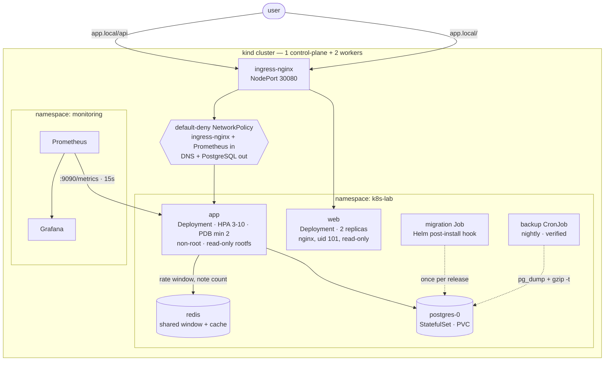

# k8s-lab

[](https://github.com/alpacino-0/k8s-lab/actions/workflows/ci.yml)
[](LICENSE)


A Node.js + PostgreSQL service and its browser interface, deployed to Kubernetes
the way they would be run in production: non-root containers with a read-only root filesystem, default-deny
network policies, a schema migration that runs once per release, verified
nightly backups, autoscaling, disruption budgets, Prometheus metrics, and a CI
pipeline that deploys to a real cluster on every push.

Every number in this README was measured on the cluster this repository builds.
The full log, including the bugs found along the way, is in
[docs/LEARNING-LOG.tr.md](docs/LEARNING-LOG.tr.md). Turkish readme:
[README.tr.md](README.tr.md).

```
Kubernetes 1.36 · kind · Helm 3 · containerd · ingress-nginx · Prometheus · Grafana · GitHub Actions
```

---

## Architecture



---

## Quick start

Requires Docker, [kind](https://kind.sigs.k8s.io/), kubectl and Helm.

```bash
git clone https://github.com/alpacino-0/k8s-lab.git && cd k8s-lab
make up                                    # cluster + ingress + build + deploy
echo "127.0.0.1 app.local" | sudo tee -a /etc/hosts
open http://app.local:8080                 # the interface
make smoke                                 # 35 end-to-end checks
```

## The interface

`http://app.local:8080` is a working notes application. It is also the quickest
explanation of what is underneath it.

Every response carries the identity of the replica that produced it, and the
page keeps a running ledger: each request drops a mark into the lane of the pod
that answered. Use the app for a few seconds and the load distribution draws
itself. Below that, each platform decision is stated with the measurement that
justified it.

The ledger deliberately does **not** query the Kubernetes API. Doing so would
mean mounting a service-account token into a pod that has no other reason to
hold one. Pod identity comes from the downward API instead — environment
variables the kubelet injects — and the browser simply counts what came back.

| Command | What it does |
|---|---|
| `make test` | Unit and integration tests (27 tests, no cluster needed) |
| `make lint` | ESLint + `helm lint` + renders every values profile |
| `make deploy` | Rebuild both images and upgrade the release |
| `make web` | Run the interface locally against a port-forwarded backend |
| `make smoke` | End-to-end checks against the running deployment |
| `make monitoring` | Install Prometheus + Grafana |
| `make down` | Delete the cluster |

---

## What this demonstrates

### Security

| Control | Where | Verified by |
|---|---|---|
| Runs as uid 1000, never root | `podSecurityContext.runAsNonRoot` | smoke test reads `id -u` from the live pod |
| Read-only root filesystem | `containerSecurityContext` + `emptyDir` for `/tmp` | container starts under `--read-only` in CI |
| All Linux capabilities dropped | `capabilities.drop: [ALL]` | asserted against the running pod spec |
| No privilege escalation, seccomp `RuntimeDefault` | pod and container security context | rendered manifests validated by kubeconform |
| No service-account token mounted | `automountServiceAccountToken: false` | neither tier calls the Kubernetes API |
| Scrape endpoint is not publicly routable | metrics on a separate port (9090) | CI asserts `/api/metrics` returns 404 |
| Interface sends CSP and frame-deny headers | `web/security-headers.conf` | asserted on the running container |
| Default-deny networking | 3 NetworkPolicies | an unauthorized pod is proven unable to reach the app |
| Multi-stage image, production deps only | `app/Dockerfile` | Trivy blocks CRITICAL/HIGH findings in CI |
| npm removed from the runtime image | `app/Dockerfile` | eliminated **every** Node.js package CVE (see below) |
| No secrets in git | `.gitignore` + chart values | password is a required chart value |
| Notes isolated per visitor | anonymous cookie, owner-scoped queries | a second visitor cannot read or delete the first one's notes |
| Writes bounded | ingress `limit-rps` + a shared window + a note cap | oversized and over-quota writes are rejected |
| Rate limits bind across replicas | Redis sliding window | 60 requests against a limit of 30: **29 allowed** shared, **60 allowed** per replica |
| Nothing kept forever | hourly retention CronJob | notes older than 24h are deleted |

The egress policy explicitly allows DNS. Forgetting that rule is the most common
way a default-deny policy silently breaks an application: name resolution fails
and every outbound call times out with no obvious cause.

### Reliability

| Behaviour | Implementation | Measured |
|---|---|---|
| Liveness never depends on the database | `/healthz` is process-only, `/readyz` checks the DB | when PostgreSQL was scaled to 0: **0 restarts**, pods left `Running` but unready; recovered **8s** after the DB returned |
| Graceful shutdown | `SIGTERM` handler closes the server and the pool | pod deletion **30s → 0s** |
| Zero-downtime node drain | PDB + topology spread + `preStop` sleep | without `preStop`: **2 of 200** requests dropped · with it: **0 of 300** |
| Zero-downtime rollout | `maxUnavailable: 0`, readiness gating | 250 requests during an upgrade, **0 failures** |
| Survives a broken release | readiness gating | an `ImagePullBackOff` rollout served **200 requests with 0 failures** |
| Autoscaling | HPA on CPU, asymmetric behaviour | 3→10 pods in **45s**; 10→2 over **~3min** |
| Data survives pod loss | StatefulSet + PVC | pod deleted, IP changed, **same volume, same rows** |
| Backups are verified, not assumed | `pg_dump \| gzip` + `gzip -t` + size check | runs on every install and nightly |

Scale-up is immediate and scale-down is deliberately slow: being late to scale
up costs users, being hasty to scale down causes thrashing.

### Operations

- **Schema migrations run once per release** as a Helm `post-install,post-upgrade`
  hook Job — not in an init container, where concurrent replicas race on DDL locks.
- **Configuration changes roll pods** via a `checksum/config` annotation; without
  it a ConfigMap update is invisible to running containers.
- **Structured JSON logs**, one object per line, ready for any log aggregator.
- **Application metrics**, not just infrastructure ones: `http_requests_total`,
  `http_request_duration_seconds`, `notes_total`, `database_up`.
- **Alerts that actually fire.** `up == 0` does *not* fire when every target
  disappears, because the series stops existing. Measured side by side under
  identical conditions:

  ```
  up{job="app"} == 0        → inactive   (never fires)
  absent(up{job="app"})     → firing     (correct)
  ```

### CI/CD

Five jobs on every push ([`.github/workflows/ci.yml`](.github/workflows/ci.yml)):

| Job | Gate |
|---|---|
| `test` | ESLint and 27 tests for the API; ESLint and a production build for the interface |
| `manifests` | `helm lint`, renders all three values profiles, kubeconform schema validation, hadolint on both Dockerfiles |
| `image` | Builds both images, asserts each is non-root, boots each read-only, Trivy scan (fails on CRITICAL/HIGH) |
| `e2e` | Creates a real kind cluster, installs the chart, checks both ingress routes, runs the 35-check smoke test, then proves an upgrade drops zero requests |
| `publish` | Pushes both images to GHCR for amd64 and arm64, with SBOM and provenance attestation (main only) |

---

## Layout

```
app/                  Node.js service
  src/                config · logger · metrics · db · app · index
  test/               unit and integration tests (node:test, no framework)
  Dockerfile          multi-stage, pinned base, non-root
web/                  React interface (Vite), served by unprivileged nginx
  src/                app · pod ledger · notes · mechanisms
  nginx.conf          SPA fallback, CSP, writes confined to /tmp
chart/                Helm chart — the single deployment path
  templates/          18 resource templates + helpers
  values.yaml         documented defaults
  values-dev.yaml     minimal footprint, demo endpoints on
  values-prod.yaml    autoscaling, backups, monitoring, network policies
  values-public.yaml  GHCR images, TLS, external secret — for a public address
scripts/
  bootstrap.sh        idempotent cluster + ingress + deploy
  smoke-test.sh       35 end-to-end checks including security posture
  teardown.sh         destroy the cluster
docs/
  DEPLOY.md           runbook for putting this on a public address
  LEARNING-LOG.tr.md  measured results and the bugs found (Turkish)
```

---

### Shrinking the attack surface

The first Trivy scan reported roughly thirty CRITICAL/HIGH findings. Almost none
of them came from the application's own dependencies — they came from **npm**,
which the base image ships and the runtime never uses. The entrypoint is
`node src/index.js`; npm and its dependency tree (`tar`, `minimatch`, `glob`,
`sigstore`, ...) are build-time tools that were being shipped to production.

```dockerfile
RUN apk upgrade --no-cache
RUN rm -rf /usr/local/lib/node_modules/npm /usr/local/bin/npm /usr/local/bin/npx \
           /opt/yarn-* /usr/local/bin/yarn /usr/local/bin/yarnpkg
```

| | Before | After |
|---|---|---|
| Node.js package findings | ~20 HIGH, 1 CRITICAL | **0** |
| OS package findings | 11 HIGH/CRITICAL | **0** |
| Image size | 205 MB | 206 MB |

Pinning the base tag keeps builds reproducible; `apk upgrade` keeps them patched.

## Two bugs this project found

Both were found by breaking things on purpose, and both are the kind of fault
that only shows up under failure.

**The application crashed whenever the database restarted.** `node-postgres`
emits an `error` event on the `Pool` when an idle connection is terminated. With
no listener, Node treats it as an unhandled `'error'` event and kills the
process. Scaling PostgreSQL to zero took down all three replicas:

```
node:events:502  throw er; // Unhandled 'error' event
error: terminating connection due to administrator command
```

One listener fixed it. Afterwards the same test produced **0 restarts** —
readiness removed the pods from the Service and liveness left them alone.

**`helm --wait` hung forever on a healthy cluster.** The backup PVC uses a
`WaitForFirstConsumer` StorageClass, so it stays `Pending` until something
mounts it — and its only consumer was a CronJob scheduled for 02:00. The fix is
twofold: wait on the workloads that matter instead of the whole release, and
take one verified backup during install, which both proves the backup path works
and binds the volume.

---

### A fourth bug, found by reading the traffic

Wiring the interface exposed something the manifests had claimed but never
enforced: the ingress routed `/api` to the service, and `/metrics` sat on that
same port, so the raw Prometheus scrape endpoint was publicly reachable. The fix
was not an ingress rule but a second listener — telemetry now serves on port
9090, which nothing outside the cluster is routed to and which the network
policy opens only to Prometheus. CI asserts `/api/metrics` returns 404.

Two smaller ones came from the same session: nginx silently drops every
inherited `add_header` as soon as a nested block sets one of its own, so the
security headers were never sent; and the interface's Service was carrying the
API's `app.kubernetes.io/name` label, which made Prometheus try to scrape
`/metrics` from nginx.

## Ready for a public address

The demo can be put on a URL strangers can reach. What that required, and why:

**Anyone can use it, nobody shares a table.** Requiring a login would mean
nobody tries the demo; a shared unbounded table becomes a spam wall within
hours of being linked. Notes are scoped to an anonymous visitor cookie
instead — no signup, and every query is filtered by owner. Verified in CI: a
second visitor cannot read or delete the first one's notes.

**Writes are bounded three ways.** The ingress limits each client IP
(`25r/s`, burst 125, 20 concurrent connections). The application counts per
visitor in a Redis sliding window shared by every replica. And each visitor may
hold 20 notes at a time, which is what stops storage growing rather than what
stops request rate.

The shared window is there because the in-process one was quietly broken. Three
replicas each counted separately, so a client got three times its allowance —
the code said so in a comment and nothing tested it. Measured, 60 requests
against a limit of 30 per minute:

| | Allowed | Rejected |
|---|---|---|
| Per-replica counters | **60** | 0 |
| Shared window | **29** | 31 |

CI now runs that comparison on every push. Redis is optional: with it
unavailable the service falls back to per-replica counting and a cold cache
rather than failing, which was verified by removing its address from a running
deployment — requests kept being served, only the limit went loose.

**Nothing is kept forever.** An hourly CronJob deletes notes older than 24
hours. Rows written before the owner column existed carry a sentinel owner:
invisible to everyone, and removed by the same job.

**Text is sanitised, not trusted.** Control characters are stripped, length is
capped at 500, the JSON body at 32kb, and the interface renders text as text.

**Everything needed to publish is prepared but unused.** `chart/values-public.yaml`
points at the published GHCR images, turns on TLS through cert-manager, marks
the visitor cookie `Secure`, and takes the database password from a secret
created outside the chart so it never appears in a file or a shell history.
[docs/DEPLOY.md](docs/DEPLOY.md) is the runbook: k3s on a small VPS,
ingress-nginx, cert-manager, one `helm upgrade`. The path was validated by
deploying that profile from GHCR into a throwaway namespace — 31/31 checks —
so what remains is a server and a domain, not unknowns.

Still missing before this is a product rather than a reachable demo:
off-cluster backups, and someone who gets paged.

## Known limitations

This runs on a local kind cluster. Before it could carry real traffic:

- **No TLS.** The chart supports `ingress.tls`, but issuing certificates needs
  cert-manager and a real domain.
- **Secrets are plain Kubernetes Secrets** — base64, not encryption. Production
  needs external secret management and etcd encryption at rest.
- **PostgreSQL is a single replica** with no failover, and backups land on a PVC
  in the same cluster. Real backups belong in object storage, off-cluster.
- **No PodSecurity admission or OPA/Kyverno policies** enforcing the security
  context cluster-wide; the chart sets it, nothing stops a bad deployment.
- **No distributed tracing.** Metrics and logs only.

---

## License

MIT — see [LICENSE](LICENSE).
