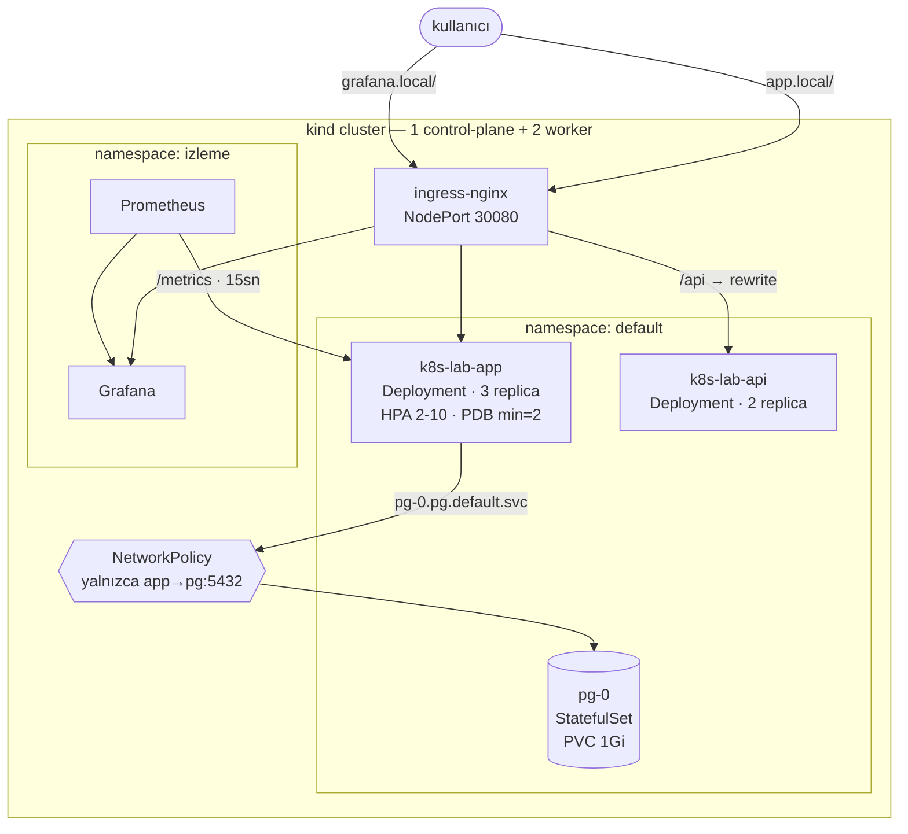

# k8s-lab

Node.js + PostgreSQL uygulamasının konteynerlenip 3 node'luk bir Kubernetes cluster'ında
üretim pratikleriyle çalıştırıldığı uygulamalı laboratuvar.

Buradaki her sayı ölçülmüştür — kaos testleri yapıldı, sonuçlar kaydedildi, bulunan hatalar
düzeltildi. Ayrıntılar [ÖLÇÜMLER.md](OLCUMLER.md) dosyasında.

```
Kubernetes v1.36.1 · kind · containerd · Helm · Prometheus + Grafana · ingress-nginx
```

---

## Mimari



**İstek yolu:** `curl` → kind port mapping (host 8080 → node 30080) → ingress-nginx →
host/path kuralı → Service → kube-proxy → Pod.

---

## Neyi gösteriyor

| Alan | Uygulanan | Ölçülen sonuç |
|---|---|---|
| **Self-healing** | Deployment + ReplicaSet | Pod silindi → **2 saniyede** yenisi, kesinti yok |
| **Otomatik ölçekleme** | HPA (CPU %50) + metrics-server | 3→10 pod **45 sn** · 10→2 pod **~3 dk** |
| **Kesintisiz sürüm** | Rolling update + readinessProbe | 250 istek, **0 kesinti** |
| **Bozuk sürüme direnç** | maxUnavailable + readiness | `ImagePullBackOff` yaşandı, **0 kesinti** |
| **Geri alma** | ReplicaSet geçmişi / Helm | `rollout undo` **0.04 sn** · `helm rollback` **5.8 sn** |
| **Kesintisiz bakım** | PDB + topology spread + preStop | drain: preStop'suz **2/200 düştü**, preStop'lu **0/300** |
| **Kalıcı veri** | StatefulSet + PVC | Pod silindi, IP değişti, **veri ve disk aynı** |
| **Ağ güvenliği** | NetworkPolicy (default-deny) | Yabancı pod DB'yi okuyordu → **`timeout expired`** |
| **Yetkilendirme** | ServiceAccount + Role + RoleBinding | pods `200` · secrets **`403 Forbidden`** |
| **Yapılandırma** | ConfigMap + Secret (`envFrom`) | Aynı imaj, 4 farklı ortam |
| **Gözlemlenebilirlik** | prom-client + ServiceMonitor + PrometheusRule | Alarm: `inactive`→`pending`→`firing` |
| **Şablonlama** | Helm chart + values-dev/prod | Tek chart → 2 ortam, sıfır YAML kopyası |
| **CI/CD** | GitHub Actions | build → duman testi → gerçek kind cluster → GHCR |

---

## Hızlı başlangıç

```bash
# 1) imaj
docker build -t k8s-lab-app:3.3 ./app

# 2) cluster
kind create cluster --name k8s-lab --config kind-config.yaml
kind load docker-image k8s-lab-app:3.3 --name k8s-lab

# 3) secret'i sablondan uret
cp k8s/secret.yaml.ornek k8s/secret.yaml   # icindeki degeri doldur

# 4) deploy
kubectl apply -f k8s/

# 5) ingress controller
kubectl apply -f https://raw.githubusercontent.com/kubernetes/ingress-nginx/controller-v1.13.0/deploy/static/provider/baremetal/deploy.yaml
kubectl wait -n ingress-nginx --for=condition=Ready pod \
  -l app.kubernetes.io/component=controller --timeout=180s
kubectl patch svc ingress-nginx-controller -n ingress-nginx --type=json \
  -p='[{"op":"replace","path":"/spec/ports/0/nodePort","value":30080}]'

# 6) dogrula
echo "127.0.0.1 app.local grafana.local" | sudo tee -a /etc/hosts
curl app.local:8080          # her istek farkli pod'dan cevaplanir
curl app.local:8080/notlar   # veritabanindan okur
```

Helm ile:

```bash
helm upgrade --install prod chart -f chart/values-prod.yaml -n uygulama --create-namespace --wait
```

---

## Yapı

```
app/                  Node.js uygulamasi (Express + pg + prom-client)
  server.js           / · /notlar · /config · /healthz · /readyz · /metrics
  Dockerfile          layer caching icin bagimliliklar koddan once kopyalanir
k8s/                  ham manifestler
  deployment.yaml     init container'lar + probe'lar + preStop + topology spread
  service.yaml        ClusterIP (adlandirilmis port — ServiceMonitor icin sart)
  ingress.yaml        host + path yonlendirme, rewrite-target
  postgres.yaml       headless Service + StatefulSet + volumeClaimTemplates
  networkpolicy.yaml  default-deny + yalnizca app→pg
  rbac.yaml           ServiceAccount + Role + RoleBinding
  hpa.yaml            asimetrik scaleUp/scaleDown politikalari
  pdb.yaml            minAvailable: 2
  servicemonitor.yaml Prometheus kazima tanimi
  alerts.yaml         PrometheusRule — absent() tuzagi dahil
  migration.yaml      idempotent SQL semasi
  namespace.yaml      staging + ResourceQuota + LimitRange
chart/                ayni sistemin Helm surumu (values-dev / values-prod)
.github/workflows/    CI: build → duman testi → kind cluster → GHCR
```

---

## Tasarım kararları

**İki ayrı sağlık ucu.** `/readyz` veritabanına bakar, `/healthz` bakmaz. Liveness DB'ye
bakarsa, veritabanı bir dakika yavaşladığında **tüm pod'lar restart döngüsüne girer** —
bir arıza ikinci arızayı doğurur. Doğrusu: DB düşerse pod trafikten çıkar ama öldürülmez.

**preStop hook.** Pod silinirken endpoint'lerden çıkarılması ile sürecin ölmesi eşzamanlıdır.
`sleep 5` bu yarışı çözer. Ölçüm: preStop'suz drain 200 istekten 2'sini düşürdü, preStop'lu
drain 300 istekten hiçbirini düşürmedi.

**Graceful shutdown.** Konteynerde PID 1, handler tanımlamadığı sinyalleri yok sayar.
`process.on('SIGTERM')` olmadan her pod kapanışı 30 saniye sürer, sonra SIGKILL yer.
Ölçüm: **30 saniye → 0 saniye**.

**Secret git'te değil.** `k8s/secret.yaml` `.gitignore`'da, şablonu `secret.yaml.ornek`.
Kubernetes Secret'ı şifreleme değildir — `base64 -d` ile okunur.

**Demo uçları kapalı.** `/yuk` yalnızca `DEMO_UCLARI=true` iken açılır (HPA demosunu yeniden
üretmek için). Varsayılan kapalı — dışarıdan CPU yakılamaz.

---

## Bu lab ne değildir

Öğrenme laboratuvarıdır, üretime hazır bir sistem değil. Eksikleri açıkça:

- **TLS yok** — Ingress düz HTTP. Üretimde cert-manager + Let's Encrypt gerekir.
- **Secret yönetimi ilkel** — gerçek ortamda Vault / External Secrets / Sealed Secrets ve
  etcd encryption-at-rest gerekir.
- **Migration init container'da** — her pod başlangıcında çalışır. Gerçek migration'lar ayrı
  bir Job (veya Helm `pre-upgrade` hook'u) olarak **bir kez** çalıştırılmalıdır; aynı anda
  3 pod aynı `ALTER TABLE`'ı çalıştırırsa kilitlenir.
- **PostgreSQL tek replika** — HA yok, yedekleme yok. PV `RECLAIM POLICY: Delete`, yani PVC
  silinince veri de gider; üretimde `Retain` olmalı.
- **NetworkPolicy yalnızca pg'yi koruyor** — `k8s-lab-api` hâlâ herkese açık.
- **securityContext yok** — konteynerler root çalışıyor, filesystem read-only değil.

---

## Temizlik

```bash
helm uninstall izleme -n izleme
kind delete cluster --name k8s-lab
```
