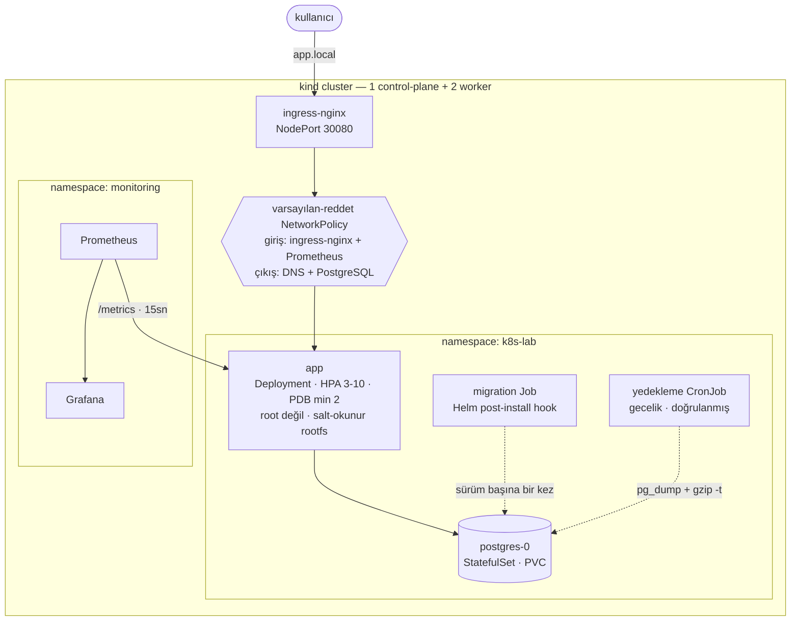

# k8s-lab

Node.js + PostgreSQL servisinin Kubernetes'e **üretimde çalıştırılacağı gibi**
kurulduğu proje: root olmayan konteynerler, salt-okunur dosya sistemi,
varsayılan-reddet ağ politikaları, sürüm başına bir kez çalışan şema migration'ı,
doğrulanmış gecelik yedekler, otomatik ölçekleme, kesinti bütçesi, Prometheus
metrikleri ve her push'ta gerçek bir cluster'a deploy eden CI hattı.

Buradaki her sayı, bu deponun kurduğu cluster üzerinde **ölçülmüştür**. Yol
boyunca bulunan hatalar dahil tüm kayıt: [docs/LEARNING-LOG.tr.md](docs/LEARNING-LOG.tr.md).
İngilizce sürüm: [README.md](README.md).

```
Kubernetes 1.36 · kind · Helm 3 · containerd · ingress-nginx · Prometheus · Grafana · GitHub Actions
```

---

## Mimari



---

## Hızlı başlangıç

Gerekenler: Docker, [kind](https://kind.sigs.k8s.io/), kubectl, Helm.

```bash
git clone https://github.com/<kullanici>/k8s-lab.git && cd k8s-lab
make up                                    # cluster + ingress + build + deploy
echo "127.0.0.1 app.local" | sudo tee -a /etc/hosts
curl app.local:8080
make smoke                                 # 18 uçtan uca kontrol
```

| Komut | Ne yapar |
|---|---|
| `make test` | Birim ve entegrasyon testleri (14 test, cluster gerekmez) |
| `make lint` | ESLint + `helm lint` + tüm values profillerini üretir |
| `make deploy` | İmajı yeniden derler ve sürümü günceller |
| `make smoke` | Çalışan deployment'a karşı uçtan uca kontroller |
| `make monitoring` | Prometheus + Grafana kurar |
| `make down` | Cluster'ı siler |

---

## Neyi gösteriyor

### Güvenlik

| Önlem | Nerede | Nasıl doğrulandı |
|---|---|---|
| uid 1000 ile çalışır, asla root değil | `podSecurityContext.runAsNonRoot` | duman testi canlı pod'da `id -u` okur |
| Salt-okunur kök dosya sistemi | `containerSecurityContext` + `/tmp` için `emptyDir` | CI'da konteyner `--read-only` ile başlatılır |
| Tüm Linux capability'leri düşürülmüş | `capabilities.drop: [ALL]` | çalışan pod spec'i üzerinden doğrulanır |
| Yetki yükseltme kapalı, seccomp `RuntimeDefault` | pod ve konteyner security context | üretilen manifest'ler kubeconform ile denetlenir |
| ServiceAccount token'ı monte edilmez | `automountServiceAccountToken: false` | uygulama Kubernetes API'sini hiç kullanmaz |
| Varsayılan-reddet ağ | 3 NetworkPolicy | yetkisiz bir pod'un erişemediği **kanıtlanır** |
| Multi-stage imaj, yalnız üretim bağımlılıkları | `app/Dockerfile` | CI'da Trivy CRITICAL/HIGH bulguda durdurur |
| Git'te secret yok | `.gitignore` + chart values | parola zorunlu bir chart değeri |

Egress politikası **DNS'e açıkça izin verir**. Bu kuralı unutmak, varsayılan-reddet
politikasının uygulamayı sessizce bozmasının en yaygın yoludur: isim çözümlemesi
başarısız olur ve her dış çağrı sebebi belli olmayan bir zaman aşımına düşer.

### Dayanıklılık

| Davranış | Uygulama | Ölçüm |
|---|---|---|
| Liveness asla veritabanına bakmaz | `/healthz` yalnız süreç, `/readyz` DB'ye bakar | PostgreSQL sıfıra indirildiğinde: **0 restart**, pod'lar `Running` ama hazır değil; DB dönünce **8 saniyede** toparlandı |
| Düzgün kapanma | `SIGTERM` işleyicisi sunucuyu ve havuzu kapatır | pod silinmesi **30sn → 0sn** |
| Kesintisiz node bakımı | PDB + topology spread + `preStop` | `preStop` yok: **200 istekten 2'si** düştü · var: **300 istekten 0'ı** |
| Kesintisiz sürüm geçişi | `maxUnavailable: 0` + readiness | geçiş sırasında 250 istek, **0 hata** |
| Bozuk sürüme direnç | readiness kapısı | `ImagePullBackOff` yaşayan bir rollout **200 istekte 0 hata** verdi |
| Otomatik ölçekleme | CPU tabanlı HPA, asimetrik davranış | 3→10 pod **45 saniyede**; 10→2 pod **~3 dakikada** |
| Pod ölse de veri yaşar | StatefulSet + PVC | pod silindi, IP değişti, **aynı disk, aynı kayıtlar** |
| Yedekler varsayılmaz, doğrulanır | `pg_dump \| gzip` + `gzip -t` + boyut kontrolü | her kurulumda ve her gece çalışır |

Büyüme anında, küçülme kasten yavaştır: büyümede geç kalmanın bedelini kullanıcı
öder, küçülmede acele etmek zikzağa (thrashing) yol açar.

### İşletim

- **Şema migration'ları sürüm başına bir kez** çalışır — Helm `post-install,post-upgrade`
  hook Job'u olarak. Init container'da olsaydı eşzamanlı replikalar DDL kilitlerinde yarışırdı.
- **Config değişince pod'lar yenilenir** — `checksum/config` anotasyonu sayesinde.
  Olmasaydı ConfigMap güncellenir ama çalışan konteynerler eski değeri kullanmaya devam ederdi.
- **Yapılandırılmış JSON loglar**, satır başına bir nesne; her log toplayıcı doğrudan ayrıştırır.
- **Uygulama metrikleri**, sadece altyapı metrikleri değil: `http_requests_total`,
  `http_request_duration_seconds`, `notes_total`, `database_up`.
- **Gerçekten ateşleyen alarmlar.** `up == 0`, tüm hedefler yok olduğunda ateşlemez;
  çünkü seri de yok olur. Aynı koşullarda yan yana ölçüldü:

  ```
  up{job="app"} == 0        → inactive   (hiç ateşlemez)
  absent(up{job="app"})     → firing     (doğrusu)
  ```

### CI/CD

Her push'ta beş job ([`.github/workflows/ci.yml`](.github/workflows/ci.yml)):

| Job | Neyi denetler |
|---|---|
| `test` | ESLint, 14 birim ve entegrasyon testi |
| `manifests` | `helm lint`, üç values profilinin üretimi, kubeconform şema denetimi, hadolint |
| `image` | Derler, konteynerin root olmadığını doğrular, salt-okunur başlatır, Trivy taraması |
| `e2e` | Gerçek kind cluster kurar, chart'ı yükler, 18 kontrolü çalıştırır, ardından bir upgrade'in **sıfır istek düşürdüğünü** kanıtlar |
| `publish` | GHCR'a SBOM ve provenance ile push eder (yalnız main) |

---

## Dizin yapısı

```
app/                  Node.js servisi
  src/                config · logger · metrics · db · app · index
  test/               birim ve entegrasyon testleri (node:test, framework yok)
  Dockerfile          multi-stage, sabit sürüm, root değil
chart/                Helm chart — tek deploy yolu
  templates/          15 kaynak şablonu + helper'lar
  values.yaml         açıklamalı varsayılanlar
  values-dev.yaml     minimum ayak izi, demo uçları açık
  values-prod.yaml    otomatik ölçekleme, yedekleme, izleme, ağ politikaları
scripts/
  bootstrap.sh        idempotent cluster + ingress + deploy
  smoke-test.sh       güvenlik duruşu dahil 18 uçtan uca kontrol
  teardown.sh         cluster'ı siler
docs/
  LEARNING-LOG.tr.md  ölçümler ve bulunan hatalar
```

---

## Bu projenin bulduğu iki hata

İkisi de bilerek bir şeyleri bozarak bulundu ve ikisi de yalnızca arıza anında
ortaya çıkan türden.

**Veritabanı her yeniden başladığında uygulama çöküyordu.** `node-postgres`,
boştaki bir bağlantı koparıldığında `Pool` üzerinde bir `error` olayı yayar.
Dinleyicisi yoksa Node bunu yakalanmamış `'error'` olayı sayar ve süreci öldürür.
PostgreSQL sıfıra indirildiğinde üç replikanın üçü birden düştü:

```
node:events:502  throw er; // Unhandled 'error' event
error: terminating connection due to administrator command
```

Tek bir dinleyici sorunu çözdü. Aynı test sonrasında **0 restart** verdi —
readiness pod'ları Service'ten çıkardı, liveness onlara dokunmadı.

**`helm --wait` sağlıklı bir cluster'da sonsuza kadar bekledi.** Yedekleme PVC'si
`WaitForFirstConsumer` modundaki bir StorageClass kullanıyor; yani onu bir şey
mount edene kadar `Pending` kalıyor — ve tek kullanıcısı gece 02:00'ye planlanmış
CronJob'du. Çözüm iki parçalı: tüm sürüm yerine gerçekten önemli iş yüklerini
beklemek, ve kurulum sırasında bir kez doğrulanmış yedek almak — bu hem yedekleme
yolunun çalıştığını kanıtlar hem de volume'ü bağlar.

---

## Bilinen sınırlar

Bu proje yerel bir kind cluster'ında çalışır. Gerçek trafik taşıyabilmesi için:

- **TLS yok.** Chart `ingress.tls` destekliyor ama sertifika üretmek cert-manager
  ve gerçek bir alan adı gerektirir.
- **Secret'lar düz Kubernetes Secret'ı** — base64, şifreleme değil. Üretimde harici
  secret yönetimi ve etcd'de şifreleme gerekir.
- **PostgreSQL tek replika**, failover yok; yedekler aynı cluster'daki bir PVC'ye
  yazılıyor. Gerçek yedekler cluster dışında, nesne depolamada durmalı.
- **PodSecurity admission veya OPA/Kyverno yok** — chart güvenlik ayarlarını
  koyuyor ama hatalı bir deployment'ı engelleyen bir mekanizma yok.
- **Dağıtık izleme (tracing) yok.** Yalnızca metrik ve log var.

---

## Lisans

MIT — [LICENSE](LICENSE).
