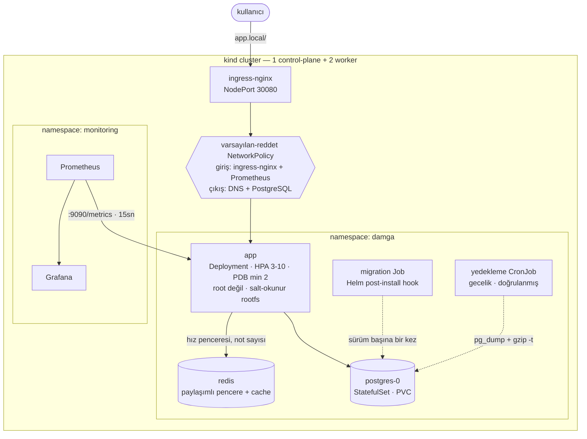

# Damga

[](https://github.com/damgahq/damga/actions/workflows/ci.yml)
[](LICENSE)


**Kubernetes üzerinde çalışan, tek tuşla deploy eden Coolify.** Kendi kodunu da,
n8n gibi hazır bir uygulamayı da, Deployment'ın ne olduğunu bilmeden kurarsın.

Coolify **sunucu** yönetir — bir kutuya SSH ile bağlanıp Docker çalıştırır.
Damga **küme** yönetir. Tek makinede tek uygulama için Coolify daha kolay, ve
aksini iddia etmek dürüst olmaz. Fark ikinci makinede ortaya çıkıyor:

> Coolify'da ikinci sunucu, deploy ettiğin ikinci kutudur. Damga'da ikinci node,
> aynı uygulamanın zaten gidebileceği bir yerdir — uygulama tanımında tek satır
> değişmez.

İkinci fark yedekler. Bu alandaki herkes yedek alıyor. Bu, her yedeği geçici bir
veritabanına geri yükleyip satırları kaynağa karşı sayıyor ve cevabı sayfaya
yazıyor — böylece *"yedeğimiz var"* ile *"yedek çalışıyor"* aynı cümle olmaktan
çıkıyor. **Deploy ettiğin platformların hiçbiri bunu yapmıyor.** Pratik yeni
değil — Veeam yıllardır yedeği izole bir lab'da açıp doğruluyor — ama geliştirici
platformlarında yok, ve dışarıdan takılan küçük bir servis pazarı tam da bu
yüzden var. Bu cümlenin arkasındaki tarama, her satırı kaynağıyla birlikte:
[docs/BACKUP-SURVEY.md](docs/BACKUP-SURVEY.md).

**Her şey ücretsiz ve açık kaynak.** Her özellik bu depoda — kurumsal sürüm
yok, saklanan hiçbir şey yok. Projenin ileride bir şey için ücret alıp
almayacağı karara bağlanmadı; bağlandığı gün bu satır bunu açıkça yazacak, ve
bir kez yayımlanmış olan yayımlanmış kalır.

## Bugün ne var

Bir kontrol düzlemi (panel, API, deploy geçmişi), `Workload` özel kaynağını
Deployment, Service, Ingress, HorizontalPodAutoscaler, PodDisruptionBudget ve
NetworkPolicy'ye render eden bir operator, gecelik yedekleri ve yukarıdaki geri
yükleme provasıyla bir `Database` kaynağı, takım ve rolleriyle kimlik, ve bir
GitOps yazma yolu — her değişiklik Argo CD'nin uyguladığı bir commit, yani geri
alma bir revert.

2026-09-01'den beri derliyor da: bir `Build` bir repoyu ve bir commit'i
adlandırıyor, platform onu klonluyor, imaj üretiyor ve yanında kurduğu bir
depoya itiyor. Repoda Dockerfile varsa o kullanılıyor, yoksa dil tanınıyor. Alan
adı bildiren bir `Workload` artık ingress'in yanında sertifika da alıyor.

**Henüz yok — var olanla değil, eksik olanla anlatılmış hâli.** Alan adları
API'den çalışıyor, panelden değil. Çalışan bir konteynere `exec` yok, zamanlanmış
görev yok. Yedekler geri yüklenerek kanıtlanıyor ama S3'e gitmiyor. Bir
uygulamanın kendi metrikleri — CPU'su, belleği, yeniden başlamaları —
toplanmıyor, ve biri bozulduğunda size kimse söylemiyor: alarm zinciri
Alertmanager'a kadar kurulu ve sınanıyor, receiver'ı hâlâ `null`.

Katalog, sunduğu 341 şablonun 202'sini kuruyor; kalanı sessizce değil adıyla
reddediliyor — çoğunlukla API'nin kabul etmediği bir imaj ve bu platformun
üretemediği değerler yüzünden. İçlerinden biri, gotify, CI'da uçtan uca
kanıtlanıyor: katalogdan gerçek bir kümeye kuruluyor ve kendi ucundan cevap
veriyor. Diğer 201'i ise `whyRefused`'ın "kurulur" dediği şey, ki bu onların
koştuğunu görmüş olmakla aynı şey değil.

## Ne kaldırıldı, neden

2026-08-29'a kadar bu proje admission'da imza doğrulaması yapıyor ve bir dizi
ValidatingAdmissionPolicy zorluyordu. İkisi de kaldırıldı.

Yanlış oldukları için değil, **ürünü imkânsız kıldıkları için** kaldırıldılar.
Tek tuşluk bir kurulum, imzasız olan, çoğu zaman kendi dosya sistemine yazması
gereken ve internete çıkması gereken üçüncü parti bir imaj getiriyor — ve
imzalama akışı kullanıcıdan, sahibi bile olmayabileceği bir repoya pull request
merge etmesini istiyordu. Altı kural vardı ve her biri bir ret sebebiydi.

Kalanlar sahibi kısıtlamak yerine komşuyu koruyor: `restricted` düzeyinde **Pod
Security Admission** ve kiracı başına **ResourceQuota**. Operator hâlâ
sertleştirilmiş pod render ediyor — non-root, read-only kök dosya sistemi, tüm
capability'ler düşük, service-account token yok — ama bu artık bir kural değil,
bir gelenek; ve bu paragraf kimse sürprizle keşfetmesin diye burada.

Aşağıdaki her sayı, bu deponun kurduğu cluster üzerinde ölçüldü. English readme:
[README.md](README.md).

```
Kubernetes 1.36 · kind · Helm 3 · containerd · ingress-nginx · Prometheus · Grafana · GitHub Actions
```

---

## Mimari



---

## Hızlı başlangıç

Gerekenler: Docker, [kind](https://kind.sigs.k8s.io/), kubectl, Helm, Terraform, jq.
Aşağıdaki operator hedefleri ayrıca Go istiyor; controller-gen ve kustomize'ı
operator'ın kendi Makefile'ı indiriyor.

```bash
git clone https://github.com/damgahq/damga.git && cd damga
make up                                    # cluster + ingress + build + deploy
echo "127.0.0.1 app.local" | sudo tee -a /etc/hosts
curl http://app.local:8080/stats           # servis
make smoke                                 # 30 uçtan uca kontrol
```

Bu, kümeyi ve örnek iş yükünü ayağa kaldırır. Kontrol düzlemi — panel, API ve
kanıt deposu — kendi başına çalışır, kümeye ihtiyaç duymaz:

```bash
go build -o damga ./cmd/damga
./damga bootstrap -evidence-dsn ./damga.db -email siz@example.com -tenant acme
./damga -evidence-dsn ./damga.db -listen-address 127.0.0.1:8080
```

`bootstrap` parolayı bir kez yazdırır. Yanlış ayarlanması kolay bayraklar,
API'de ne olduğu ve henüz neyin yazılmadığı için:
[docs/CONTROL-PLANE.md](docs/CONTROL-PLANE.md).

## Servis

`http://app.local:8080` çalışan bir notlar API'si. Her yanıt, onu üreten
replikanın kimliğini taşıyor; birkaç istek yük dağılımını görmeye yetiyor.

Bu kimlik Kubernetes API'sinden **bilerek** gelmiyor. Oradan okumak, başka
hiçbir sebebi olmayan bir pod'a ServiceAccount token'ı bağlamak demekti. Kimlik
bunun yerine downward API'den geliyor — kubelet'in enjekte ettiği ortam
değişkenleri.

| Komut | Ne yapar |
|---|---|
| `make test` | Birim ve entegrasyon testleri (29 test, cluster gerekmez) |
| `make lint` | ESLint + `helm lint` + tüm values profillerini üretir |
| `make deploy` | İmajı yeniden derler ve sürümü günceller |
| `make smoke` | Çalışan deployment'a karşı uçtan uca kontroller |
| `make policies` | Kabul politikalarını uygular |
| `make alert-test` | Servisi gerçekten bozup alarmın Alertmanager'a ulaştığını kanıtlar |
| `make operator-test` | Operator'ın birim ve envtest paketleri |
| `make operator-install` | Workload CRD'sini mevcut cluster'a kurar |
| `make operator-deploy` | Operator'ı derler, kind'a yükler ve dağıtır |
| `make tls` | cert-manager kurar, yerel CA ile HTTPS sunar |
| `make logging` | Loki + Alloy kurar, Loki'yi Grafana'ya bağlar |
| `make gitops` | Argo CD kurar, sürümü git'ten senkronlar |
| `make platform` | Platform katmanını Terraform ile uygular |
| `make platform-plan` | Terraform'un ne değiştireceğini gösterir, değiştirmez |
| `make monitoring` | Prometheus, Grafana ve Alertmanager kurar |
| `make down` | Cluster'ı siler |

---

## Workload API

Yukarıdaki servisi Helm chart'ı dağıtıyor — uzun yol, elle yazılmış hâli. Ürünün
yolu daha kısa. Girdinin tamamı bir `Workload`:

```yaml
apiVersion: platform.damga.co/v1alpha1
kind: Workload
metadata:
  name: notes
  namespace: damga
spec:
  image: ghcr.io/damgahq/damga:1.0.0
  port: 3000
  replicas: 2
```

Operator bunu bir ServiceAccount, Deployment, Service, NetworkPolicy ve
PodDisruptionBudget'a çeviriyor; `autoscale` verilirse bir HorizontalPodAutoscaler,
`domain` verilirse bir Ingress ekliyor. Ürettiği şey pazarlık konusu değil: UID
1000, salt-okunur kök dosya sistemi, tüm yetenekler düşürülmüş, service-account
token'ı yok, bulut metadata aralığını da kapatan varsayılan-reddet NetworkPolicy,
ve bir replikayı yerine geleni hazır olmadan düşürmeyen güncelleme.

Bunlar varsayılan değil. Hiçbirini kapatan alan yok, çünkü CRD'de tanımlı değil.

```bash
make policies                              # etiketli namespace ve kurallar
make operator-install                      # CRD
make operator-deploy                       # controller
kubectl apply -k config/samples/           # bir Workload
kubectl -n damga wait --for=condition=Ready workload/workload-sample
```

Namespace önemli. Üç kabul politikası da — ve imza kuralı da —
`damga.co/policies: enforced` etiketine bağlanıyor. Bu etiketi taşımayan bir
namespace, kuralları zayıf bir namespace değil — hiç kuralı olmayan bir
namespace, ve bunu söyleyen hiçbir şey yok.

İki etiket istisna tanıyor ve hiçbirini bir iş yükü kendine veremiyor:
`damga.co/api-access: permitted` ayrıca talep eden bir pod'un token'ını
bırakıyor, `damga.co/unsigned-images: permitted` ise `make up`'ın ürettiği
yerel `damga-*` imajlarını kabul ediyor. İkincisi şunun için var: imzasız bir
imaj hiçbir imza kuralının değerlendiremediği bir imaj demek, ve sessizce
kabul edilmesi *hiç kontrol edilmedi* ile *doğrulandı*'yı birbirinin aynı
gösteriyordu.

---

## Neyi gösteriyor

### Güvenlik

| Önlem | Nerede | Nasıl doğrulandı |
|---|---|---|
| uid 1000 ile çalışır, asla root değil | `podSecurityContext.runAsNonRoot` | duman testi canlı pod'da `id -u` okur |
| Salt-okunur kök dosya sistemi | `containerSecurityContext` + `/tmp` için `emptyDir` | CI'da konteyner `--read-only` ile başlatılır |
| Tüm Linux capability'leri düşürülmüş | `capabilities.drop: [ALL]` | çalışan pod spec'i üzerinden doğrulanır |
| Yetki yükseltme kapalı, seccomp `RuntimeDefault` | pod ve konteyner security context | üretilen manifest'ler kubeconform ile denetlenir |
| ServiceAccount token'ı monte edilmez | `automountServiceAccountToken: false` | servis Kubernetes API'sini hiç kullanmaz |
| Kazıma ucu dışarıya yönlendirilmez | metrikler ayrı portta (9090) | CI `/metrics` için 404 doğrular |
| Varsayılan-reddet ağ | 4 NetworkPolicy | yetkisiz bir pod'un erişemediği **kanıtlanır** |
| Multi-stage imaj, yalnız üretim bağımlılıkları | `app/Dockerfile` | CI'da Trivy CRITICAL/HIGH bulguda durdurur |
| npm runtime imajından çıkarıldı | `app/Dockerfile` | **tüm** Node.js paket CVE'lerini sıfırladı (aşağıda) |
| Git'te secret yok | `.gitignore` + chart values | parola zorunlu bir chart değeri |
| TLS, yönlendirme ve Secure çerez | cert-manager + açık Certificate | gerçek bir CA'nın verdiği sertifikayla her push'ta doğrulanır |
| Notlar ziyaretçi başına izole | anonim çerez, owner'a göre filtrelenmiş sorgular | ikinci bir ziyaretçi ilkinin notunu ne görür ne siler |
| Yazma sınırlı | ingress `limit-rps` + paylaşımlı pencere + not tavanı | uzun ve kota aşan yazmalar reddedilir |
| Limitler replikalar arası bağlayıcı | Redis kayan pencere | limit 30 iken 60 istek: paylaşımlı **29 geçti**, replika başına **60 geçti** |
| Hiçbir şey kalıcı değil | saatlik saklama CronJob'ı | 24 saatten eski notlar silinir |

Egress politikası **DNS'e açıkça izin verir**. Bu kuralı unutmak, varsayılan-reddet
politikasının uygulamayı sessizce bozmasının en yaygın yoludur: isim çözümlemesi
başarısız olur ve her dış çağrı sebebi belli olmayan bir zaman aşımına düşer.

### Zorlama

> **Kaldırıldı 2026-08-29.** Üç ValidatingAdmissionPolicy kaynak sınırlarını,
> read-only kök dosya sistemini, probları ve bir imaj allowlist'ini zorluyordu;
> on beş test her kuralın doğru şeyi reddettiğini kanıtlıyordu.
>
> Kaldırıldılar, çünkü ürünü imkânsız kılıyorlardı. Tek tuşla katalog kurulumu
> — n8n, Ghost, Plausible — imzasız, kendi dosya sistemine yazmak isteyen ve
> internete çıkması gereken üçüncü parti bir imaj getirir. Her biri bir ret
> sebebiydi. Kurallar yanlış değildi; bu ürünle bir arada duramıyorlardı.
>
> Kalanlar, sahibi kısıtlamak yerine komşuyu koruduğu için: `restricted` düzeyinde
> **Pod Security Admission** ve kiracı başına **ResourceQuota**. Kota olmadan
> tek bir kiracı node'un tüm belleğini alıp herkesi düşürebilir.
>
> Chart ve operator hâlâ sertleştirilmiş pod render ediyor — non-root, read-only
> kök, tüm capability'ler düşük, token yok. Bu artık bir kural değil, yeniden bir
> gelenek; ve bu paragraf sürprizle keşfedilmesin diye burada.

### Tedarik zinciri

Bu depodan yayımlanan imajlar mimari başına derleniyor, CI'da keyless cosign ile
imzalanıyor, ve SLSA provenance ile SBOM'u imzalı attestation olarak taşıyor. Her
imaj Trivy ile taranıyor; CRITICAL veya HIGH bulgu derlemeyi düşürüyor.

> **Kaldırıldı 2026-08-29.** Cluster bu imzaları admission'da Kyverno ile
> **doğruluyordu**, ve platform kullanıcının kendi reposuna imzalayan bir workflow
> taşıyan tek dosyalık bir PR açıyordu.
>
> İkisi de yukarıdaki politikalarla aynı sebeple kaldırıldı: doğrulama tek tuşla
> üçüncü parti kurulumu imkânsız kılıyor, ve workflow PR'ı kullanıcıdan sahibi
> bile olmayabileceği bir repoya merge yapmasını istiyordu.
>
> Kendi sürümlerimizi imzalamak kaldı. Kullanıcıya sıfır yük getiriyor ve bu
> projenin kendi artefaktlarını doğrulanabilir tutuyor.

### TLS

Sertifikayı cert-manager veriyor; `Certificate` kaynağını chart oluşturuyor ve
Ingress ürettiği secret'ı tüketiyor.

Bunu hazırlayıp hiç çalıştırmamak kolay olurdu — herkese açık kurulum bir alan
adı ister, alan adı yok. Bu yüzden CI, yerel bir sertifika otoritesinden
**gerçek bir sertifika** aldırıyor ve tüm yolu her push'ta denetliyor:

| | |
|---|---|
| `https://…/healthz` | 200, sertifikayı beklenen CA vermiş |
| `http://…/healthz` | **308** — yönlendiriliyor, servis edilmiyor |
| `Set-Cookie` | `Secure` taşıyor |

Herkese açık bir kurulumdan tek farkı sertifikayı kimin imzaladığı. `Certificate`
kaynağı, secret, nginx TLS dinleyicisi, yönlendirme ve çerez bayrağı aynı işi
yapan aynı nesneler. Let's Encrypt'e geçiş tek değer:
`--set ingress.tls.clusterIssuer=letsencrypt-prod`.

`Certificate`'ı cert-manager'ın Ingress anotasyonu yerine chart oluşturuyor.
Bu, aynı host ve aynı secret'ı paylaşan iki Ingress varken zorunluydu:
anotasyonla cert-manager ilk Ingress'i sahip yapıyor ve ikincisi için çalışmayı
reddediyordu.

```
certificate resource is not owned by this object.
refusing to update non-owned certificate resource
```

Sahip Ingress silinene kadar çalışıyordu; silindiğinde sertifika çöp toplanıyor
ve diğer Ingress sessizce sertifikasız kalıyordu. Bugün tek Ingress var, ama
`Certificate` yerinde kaldı: sahibi sürüm olduğu için ömrü hiçbir Ingress'e
bağlı değil, ve anahtar algoritması, rotasyon politikası ve yenileme penceresi
anotasyon değil chart değeri.

Yerelde: `make tls`, sonra `https://localhost:8443`. Tarayıcı uyarır — CA yerel
olduğu için. Gerçek olmayan tek şey o.

### Loglar

Uygulama her isteği değil, **eyleme değer olanı** logluyor:

| Sonuç | Seviye |
|---|---|
| 5xx | `error` |
| 4xx | `warn` |
| 250 ms'den yavaş 2xx | `warn`, süresiyle |
| diğer her şey | `debug`, yani üretimde kapalı |

Sağlıklı her istek için bir satır, saklaması para eden ve önemli satırları
gömen gürültüdür. Hiç log basmayan bir servis ise operatöre metriği
açıklayacak hiçbir şey bırakmaz. Bu ikisinin arası.

Beş 404, bir 400 ve altı başarılı istekten sonra ölçülen:

```
level=info    15   (başlangıç)
level=warn     5   (404'ler ve 400)
level=error    0
loglanan başarılı istek   0
```

Ve etiket şemasının varlık sebebi olan geçiş — Prometheus pod'u adlandırıyor,
Loki aynı adla sorgulanıyor:

```
promql:  topk(1, sum by (pod) (http_requests_total{status=~"4.."}))
         → app-damga-app-557bc659bb-dpp6p, 4×404 ve 1×400

logql:   {namespace="damga", pod="app-damga-app-557bc659bb-dpp6p"}
           | json | level=`warn`
         → warn request rejected POST /notes -> 400 (2.95ms)
```

`make logging` kuruyor. Loki tek-binary modda, filesystem depolamayla ve 72
saatlik saklamayla çalışıyor: dağıtık mod, nesne depolama ve cache'ler terabayt
işleyen cluster'lar için var; küçük bir cluster'da ağır bir log yığınının
başarısızlık biçimi, gözlemlemek için kurulduğu uygulamayı tahliye etmesidir.

### Dağıtım

CI ve Argo CD farklı işler yapıyor ve ayrım bilinçli: **CI bir değişikliği
sonra attığı bir cluster'da kanıtlar; Argo CD onu kalıcı olana uygular.**

Uzun ömürlü bir cluster'a `helm upgrade` çeken bir pipeline, biri gece 2'de
elle `kubectl` çalıştırana kadar doğrudur. Ondan sonra git ile cluster ayrışır
ve kimse fark etmez. [`gitops/application.yaml`](gitops/application.yaml) bunu
zorunlu bir değişmeze çeviriyor — `prune` git'ten çıkanı siler, `selfHeal`
dışarıdan değişeni geri alır.

Bu cluster'da ölçülen:

| Elle yapılan | Ne oldu |
|---|---|
| `kubectl scale --replicas=5` (git 2 diyor) | **5 saniyede** 2'ye döndü, `OutOfSync → Synced` kaydedildi |
| `kubectl delete deployment` | **5 saniyede** yeniden oluşturuldu |

Namespace, Pod Security Admission etiketlerini ve politika katılım etiketini
`managedNamespaceMetadata` üzerinden alıyor; yani GitOps ile yönetilen bir
sürüm, elle kurulan bir sürümle tam olarak aynı kurallara tabi.

**Sürüklenme olmayan kalıcı bir OutOfSync.** Application tam senkronken
`OutOfSync` görünüyordu. API sunucusu StatefulSet `volumeClaimTemplates`
alanına `apiVersion`, `kind`, `volumeMode` ve bir `status` bloğu ekliyor ve
bunların hiçbiri manifest'te yazılamaz. Sürekli kırmızı yanan bir sinyal,
herkesi GitOps'un var olma sebebi olan tek uyarıyı görmezden gelmeye alıştırır.
`volumeMode` artık açıkça yazılı ve sunucunun sahip olduğu üç alan, tüm blok
yerine jq yoluyla yok sayılıyor — yani depolama boyutundaki gerçek bir değişim
hâlâ görülüyor.

### Platform, kod olarak

`bootstrap.sh` ingress controller'ı, cert-manager'ı ve politikaları bir dizi
`kubectl` ve `helm` komutuyla kuruyordu. Çalışıyordu. Yapamadığı şey: ne
oluşturduğunu söylemek, tek bir şeyi geri almak, ve cert-manager'ın issuer'dan
önce var olması gerektiğini ifade etmek — sıralama satırların sırasına gömülüydü.

[`terraform/`](terraform/) artık o katmanı yönetiyor ve `make up` onu
tekrarlamak yerine çağırıyor. Cluster oluşturma dışarıda kalıyor: yerelde
`kind`'dan, uzakta bulut sağlayıcı veya k3s'ten geliyor — yani ikisi arasındaki
tek fark `kube_context`.

Çalışan bir cluster'ı buna taşırken iki şey ortaya çıktı; ikisi de gerçek bir
sisteme uygulamadan önce bilinmeli:

**Bir kabuk betiği ile bir Terraform yapılandırmasının aynı bileşenleri
kurması, iki doğruluk kaynağı demektir.** `bootstrap.sh`'ın statik manifestle
kurduğu sürümler hiç import edilemedi — devralınacak bir Helm sürümü yoktu,
yani Terraform yanlarına ikinci bir kopya kuracaktı. `bootstrap.sh` artık
Terraform'u çağırıyor.

**`kubernetes_manifest`, henüz var olmayan bir CRD'ye karşı plan yapamaz.**
Şemayı plan zamanında çözüyor; bu yüzden cert-manager `ClusterIssuer`'ları ve
Argo CD `Application`'ı sonradan uygulanan düz YAML olarak kalıyor.

Yan kazanç: ingress NodePort'ları artık kurulumdan sonra atılan bir
`kubectl patch` değil, chart değeri. Patch çalışıyordu ama Service yeniden
oluşturulsa portları geri koyacak hiçbir şey bırakmıyordu.

### Dayanıklılık

| Davranış | Uygulama | Ölçüm |
|---|---|---|
| Liveness asla veritabanına bakmaz | `/healthz` yalnız süreç, `/readyz` DB'ye bakar | PostgreSQL sıfıra indirildiğinde: **0 restart**, pod'lar `Running` ama hazır değil; DB dönünce **8 saniyede** toparlandı |
| Düzgün kapanma | `SIGTERM` işleyicisi sunucuyu ve havuzu kapatır | pod silinmesi **30sn → 0sn** |
| Kesintisiz node bakımı | PDB + topology spread + `preStop` | `preStop` yok: **200 istekten 2'si** düştü · var: **300 istekten 0'ı** |
| Kesintisiz sürüm geçişi | `maxUnavailable: 0` + readiness | geçiş sırasında 250 istek, **0 hata** |
| Bozuk sürüme direnç | readiness kapısı | `ImagePullBackOff` yaşayan bir rollout **200 istekte 0 hata** verdi |
| Otomatik ölçekleme | CPU tabanlı HPA, asimetrik davranış | 3→10 pod **45 saniyede**; 10→2 pod **~3 dakikada** |
| Pod ölse de veri yaşar | StatefulSet + PVC | pod silindi, IP değişti, **aynı disk, aynı kayıtlar** |
| Yedekler varsayılmaz, doğrulanır | `pg_dump \| gzip` + `gzip -t` + boyut kontrolü | her kurulumda ve her gece çalışır |

Büyüme anında, küçülme kasten yavaştır: büyümede geç kalmanın bedelini kullanıcı
öder, küçülmede acele etmek zikzağa (thrashing) yol açar.

### İşletim

- **Şema migration'ları sürüm başına bir kez** çalışır — Helm `post-install,post-upgrade`
  hook Job'u olarak. Init container'da olsaydı eşzamanlı replikalar DDL kilitlerinde yarışırdı.
- **Config değişince pod'lar yenilenir** — `checksum/config` anotasyonu sayesinde.
  Olmasaydı ConfigMap güncellenir ama çalışan konteynerler eski değeri kullanmaya devam ederdi.
- **Loglar toplanıyor ve sorgulanabiliyor**, sadece yapılandırılmış değil. Loki
  saklıyor, Grafana Alloy taşıyor ve etiketler Prometheus metriklerindekiyle
  aynı adlarda — yani panodaki bir sıçrama ile arkasındaki satırlar tek etiket
  uzaklıkta. Promtail bariz seçim olurdu; Mart 2026'da desteği bitti, bu yüzden
  Alloy kullanılıyor.
- **Uygulama metrikleri**, sadece altyapı metrikleri değil: `http_requests_total`,
  `http_request_duration_seconds`, `notes_total`, `database_up`.
- **Gerçekten ateşleyen alarmlar.** `up == 0`, tüm hedefler yok olduğunda ateşlemez;
  çünkü seri de yok olur. Aynı koşullarda yan yana ölçüldü:

  ```
  up{job="app"} == 0        → inactive   (hiç ateşlemez)
  absent(up{job="app"})     → firing     (doğrusu)
  ```

### CI/CD

Sekiz job ([`.github/workflows/ci.yml`](.github/workflows/ci.yml)) — beşi her
push'ta, üçü yalnız `main`'de:

| Job | Neyi denetler |
|---|---|
| `test` | API için ESLint + 29 test |
| `manifests` | `helm lint`, values profilleri, kubeconform şema denetimi, `terraform fmt -check` ve `validate`, her Dockerfile için hadolint |
| `image` | İmajları derler, hiçbirinin root olmadığını doğrular, API imajını salt-okunur başlatır, Trivy taraması |
| `operator` | Go test paketi, ve commit'lenmiş üretilmiş kodun tiplerden çıkanla aynı olduğunun denetimi |
| `e2e` | Gerçek kind cluster kurar, namespace ve kotayı uygular, chart'ı kurar, 30 duman kontrolünü çalıştırır, bir upgrade'in **sıfır istek düşürdüğünü** kanıtlar, sonra operatörü kurup bir `Workload`'ı Ready'ye götürür |
| `build` · `publish` | Her mimariyi kendi üstünde derler, SBOM ve provenance ile GHCR'a push eder, keyless cosign ile imzalar (yalnız main) |

---

## Dizin yapısı

```
app/                  Node.js servisi
  src/                config · logger · metrics · db · redis · ratelimit · visitor · app · index
  test/               birim ve entegrasyon testleri (node:test, framework yok)
  Dockerfile          multi-stage, sabit sürüm, root değil
chart/                Helm chart — tek deploy yolu
  templates/          18 kaynak şablonu + helper'lar
  values.yaml         açıklamalı varsayılanlar
  values-dev.yaml     minimum ayak izi, demo uçları açık
  values-prod.yaml    otomatik ölçekleme, yedekleme, izleme, ağ politikaları
  values-public.yaml  GHCR imajı, TLS, harici secret — herkese açık adres için
go.mod                tek modül, github.com/damgahq/damga
api/v1alpha1/         Workload tipleri — sertleştirmeyi kapatan bir alan yok
cmd/operator/         controller'ın main'i, ince tutuluyor
internal/controller/  reconciler ve ürettiği kaynaklar
config/               operator'ün kustomize manifestleri, CRD dahil
Dockerfile.operator   cmd/operator'ü derler; bağlam deponun kökü
Makefile.operator     kubebuilder hedefleri; ayrı duruyor çünkü `test`,
                      `build`, `lint` ve `deploy` yukarıda başka şey demek
terraform/            platform katmanı: ingress, cert-manager, Argo CD, metrics-server, sealed-secrets
gitops/               Argo CD Application'ları: sürüm ve operator
cluster/              cluster kapsamlı eklentiler, chart'ın dışında
  issuers.yaml        yerel CA — TLS yolu varsayılmıyor, çalıştırılıyor
  loki-values.yaml    tek-binary Loki, filesystem depolama, 72 saat saklama
  alloy-values.yaml   log toplayıcı, metriklerle aynı etiketlerle
  argocd-values.yaml  Dex, bildirim ve ApplicationSet olmadan Argo CD
  monitoring-values.yaml  Alertmanager: bir kesinti, dört değil bir uyarı
  metrics-server-values.yaml  --kubelet-insecure-tls yok; sertifikalar gerçek
  sealed-secrets-values.yaml  bir sırrın git'te yaşamasını sağlayan controller
policies/             cluster politikası, bilerek chart'ın dışında
  namespace.yaml      Pod Security Admission etiketleri
  tenant-quota.yaml   bir namespace'in alabileceği toplamın tavanı
scripts/
  bootstrap.sh        idempotent cluster + ingress + politikalar + deploy
  approve-kubelet-certs.sh  metrics-server'ın doğrulayacağı sertifika için
  seal-secret.sh      Secret girer, SealedSecret çıkar; kubeseal konteynerde
  alert-test.sh       gerçek bir kesinti yaratıp alarmın gelmesini bekler
  smoke-test.sh       güvenlik duruşu ve izolasyon dahil 30 uçtan uca kontrol
  teardown.sh         cluster'ı siler
```

---

### Saldırı yüzeyini küçültmek

İlk Trivy taraması yaklaşık otuz CRITICAL/HIGH bulgu verdi. Neredeyse hiçbiri
uygulamanın kendi bağımlılıklarından değildi — **npm**'den geliyorlardı. Temel
imaj npm'i taşıyor, ama çalışma anında hiç kullanılmıyor: giriş noktası
`node src/index.js`. npm ve bağımlılık ağacı (`tar`, `minimatch`, `glob`,
`sigstore`, ...) derleme zamanı araçları, üretime gönderilmemeliydi.

```dockerfile
RUN apk upgrade --no-cache
RUN rm -rf /usr/local/lib/node_modules/npm /usr/local/bin/npm /usr/local/bin/npx \
           /opt/yarn-* /usr/local/bin/yarn /usr/local/bin/yarnpkg
```

| | Öncesi | Sonrası |
|---|---|---|
| Node.js paket bulgusu | ~20 HIGH, 1 CRITICAL | **0** |
| OS paket bulgusu | 11 HIGH/CRITICAL | **0** |
| İmaj boyutu | 205 MB | 206 MB |

Temel imajı sabitlemek build'leri tekrarlanabilir tutar; `apk upgrade` yamalı tutar.

## Bu projenin bulduğu hatalar

İkisi de bilerek bir şeyleri bozarak bulundu ve ikisi de yalnızca arıza anında
ortaya çıkan türden.

**Veritabanı her yeniden başladığında uygulama çöküyordu.** `node-postgres`,
boştaki bir bağlantı koparıldığında `Pool` üzerinde bir `error` olayı yayar.
Dinleyicisi yoksa Node bunu yakalanmamış `'error'` olayı sayar ve süreci öldürür.
PostgreSQL sıfıra indirildiğinde üç replikanın üçü birden düştü:

```
node:events:502  throw er; // Unhandled 'error' event
error: terminating connection due to administrator command
```

Tek bir dinleyici sorunu çözdü. Aynı test sonrasında **0 restart** verdi —
readiness pod'ları Service'ten çıkardı, liveness onlara dokunmadı.

**`helm --wait` sağlıklı bir cluster'da sonsuza kadar bekledi.** Yedekleme PVC'si
`WaitForFirstConsumer` modundaki bir StorageClass kullanıyor; yani onu bir şey
mount edene kadar `Pending` kalıyor — ve tek kullanıcısı gece 02:00'ye planlanmış
CronJob'du. Çözüm iki parçalı: tüm sürüm yerine gerçekten önemli iş yüklerini
beklemek, ve kurulum sırasında bir kez doğrulanmış yedek almak — bu hem yedekleme
yolunun çalıştığını kanıtlar hem de volume'ü bağlar.

---

### Trafiği okurken çıkan bir diğeri

Trafiği servise yönlendirmek, manifest'lerin iddia ettiği ama hiç uygulamadığı
bir açığı ortaya çıkardı: `/metrics`, ingress'in yayımladığı portta duruyordu —
yani ham Prometheus kazıma ucu dışarıdan erişilebilirdi. Çözüm bir ingress
kuralı değil, ikinci bir dinleyici oldu: telemetri artık 9090 portunda,
dışarıdan hiçbir yönlendirme almıyor ve ağ politikası o portu yalnızca
Prometheus'a açıyor. CI `/metrics` için 404 bekliyor.

## Herkese açık bir adrese hazır

Demo, yabancıların erişebileceği bir URL'e konabilir. Bunun için gerekenler ve
sebepleri:

**Herkes kullanabilir ama kimse aynı tabloyu paylaşmaz.** Giriş zorunlu olsaydı
kimse demoyu denemezdi; ortak ve sınırsız bir tablo ise link paylaşıldıktan
birkaç saat sonra spam duvarına döner. Notlar bunun yerine anonim bir ziyaretçi
çerezine bağlı — kayıt yok, ve her sorgu sahibe göre filtreleniyor. CI'da
doğrulanıyor: ikinci bir ziyaretçi ilkinin notunu ne okuyabiliyor ne silebiliyor.

**Yazma üç katmanda sınırlı.** Ingress her istemci IP'sini sınırlıyor (`25r/s`,
burst 125, 20 eşzamanlı bağlantı). Uygulama, ziyaretçi başına sayımı bütün
replikaların paylaştığı bir Redis kayan penceresinde yapıyor. Ve her ziyaretçi
aynı anda 20 not tutabiliyor; depolama büyümesini durduran bu.

Paylaşımlı pencere, süreç içi olanın sessizce bozuk olması yüzünden eklendi. Üç
replika ayrı ayrı sayıyordu, yani istemci hakkının üç katını alıyordu — kod bunu
bir yorumda itiraf ediyordu ama hiçbir test doğrulamıyordu. Ölçüm, dakikada 30
limitine karşı 60 istek:

| | Geçen | Reddedilen |
|---|---|---|
| Replika başına sayaç | **60** | 0 |
| Paylaşımlı pencere | **29** | 31 |

CI artık bu karşılaştırmayı her push'ta çalıştırıyor. Redis opsiyonel: erişilemez
olduğunda servis çökmüyor, replika başına sayıma ve soğuk cache'e düşüyor —
çalışan bir deployment'tan Redis adresi silinerek doğrulandı; istekler
karşılanmaya devam etti, yalnızca limit gevşedi.

**Hiçbir şey kalıcı değil.** Saatlik bir CronJob 24 saatten eski notları siliyor.
Owner sütunu eklenmeden önce yazılmış satırlar bir sentinel sahiple işaretli:
kimseye görünmüyorlar ve aynı iş tarafından temizleniyorlar.

**Metin temizleniyor, güvenilmiyor.** Kontrol karakterleri ayıklanıyor, uzunluk
500 karakterle, JSON gövdesi 32kb ile sınırlı.

**Yayına almak için gereken her şey hazır, ama kullanılmıyor.**
`chart/values-public.yaml` yayınlanmış GHCR imajını gösteriyor, cert-manager
ile TLS'i açıyor, ziyaretçi çerezini `Secure` işaretliyor ve veritabanı
parolasını chart dışında oluşturulmuş bir secret'tan alıyor — yani parola ne bir
dosyaya ne kabuk geçmişine giriyor.
[docs/DEPLOY.md](docs/DEPLOY.md) adım adım kılavuz: küçük bir VPS'te k3s,
ingress-nginx, cert-manager, tek `helm upgrade`.
Bu yol, aynı profil GHCR'dan geçici bir namespace'e kurulup üstünde duman
testi çalıştırılarak doğrulandı — yani geriye kalan bir sunucu ve bir alan adı,
bilinmeyen değil.

Ürün olması için hâlâ eksik olanlar: cluster dışı yedekler ve gece uyandırılacak
bir sorumlu.

## Bilinen sınırlar

Bu, yerel bir kind cluster'ında çalışıyor. TLS gerçek ve her push'ta
sınanıyor; geri yükleme provası da öyle — ikisi de bu listede değil. Admission
zorlaması ve imza doğrulaması bu listede *değildi*; kaldırıldılar, sebebi bu
dosyanın başında. Hâlâ eksik olanlar:

- **Artık asıl sır, mühürleme anahtarı.** `SealedSecret` nesneleri commit
  edilebilir, yani veritabanı parolası GitOps'un tarif edemediği tek şey olmaktan
  çıktı — `make gitops` onu elle yaratmak yerine mühürlüyor. Ama bu, sorunu
  kaldırmadı, **yerini değiştirdi**: anahtarı controller üretiyor, kendinde
  tutuyor ve mühürlediğini çözebilen tek şey o. Yalnızca bu depodan yeniden
  kurulan bir cluster, eskisinin mühürlediği hiçbir şeyi okuyamaz. Anahtarı
  yedekle ya da yeniden mühürlemeyi göze al. etcd'de şifreleme hâlâ yok, yani
  çözülmüş Secret diskte diğerleri gibi base64.
- **PostgreSQL tek replika**, failover yok; yedekler aynı cluster'daki bir PVC'ye
  yazılıyor. Yedekler doğrulanıyor — her kurulumda ve her gece `gzip -t` ve bir
  boyut tabanı — ama kaynağıyla aynı arıza alanını paylaşan bir yedek, yedek
  değildir. Gerçek olanlar cluster dışında, nesne depolamada durmalı.
- **Kubelet sertifikalarını bir script onaylıyor.** `bootstrap.sh` bulduğu her
  `kubernetes.io/kubelet-serving` isteğini onaylıyor; saniyeler önce kendi
  kurduğu bir cluster için doğru, başka her yerde yanlış. Gerçek bir cluster'da
  hangi node'un hangi adresi iddia edebileceğine dair bir politika gerekir.
- **Alarmların ineceği bir yer yok.** Alertmanager çalışıyor, gruplama ve
  inhibition yapıyor — `make alert-test` servisi gerçekten bozup alarmın
  ulaştığını ve bir critical'ın aynı arızayı anlatan warning'leri susturduğunu
  kanıtlıyor. Ama receiver `null`. Bir alarmın nereye gideceği cluster'ı
  işletenin özelliğidir, ve gerçek her seçenek klonlayan kimsede olmayan bir
  kimlik bilgisi ister.
- **Tek kota, elle yazılmış, ve konteyner tavanı yok.** Namespace'in elle
  boyutlanmış bir tavanı var. Kiracı başına türeten bir şey yok, çünkü henüz tek
  kiracı var. Konteyner başına tavan admission politikalarıyla birlikte gitti;
  yani bir kiracı artık tüm kotasını tek pod'a verebilir.
- **Hiçbir imaj doğrulanmıyor.** Katalogdan kurulan her şey dâhil. Tek tuşluk
  kurulum için bilinçli bir takas; gizlenmek yerine kaydedildi.
- **Dağıtık izleme (tracing) yok.** Yalnızca metrik ve log var.

---

## Lisans

AGPL-3.0 — [LICENSE](LICENSE).

Çalıştırmak bedava ve hiçbir yükümlülük doğurmuyor, ticari kullanım dahil:
kendi makinene kur, üstünde ne istersen çalıştır, değiştir, kimseye söyleme.
Lisans yalnızca tek bir gruptan kaynak istiyor — bu yazılımı başkalarına
**servis olarak sunandan**. Değiştirilmiş bir kopyayı üçüncü kişilere ürün
olarak koşuyorsan, o değişiklikler de yayımlanmak zorunda.

Katkılar CLA ile kabul ediliyor. Telif hakkını tek elde tutuyor, böylece
AGPL'in uymadığı kurumlara ticari lisans sunulabiliyor —
[CONTRIBUTING.md](CONTRIBUTING.md).
