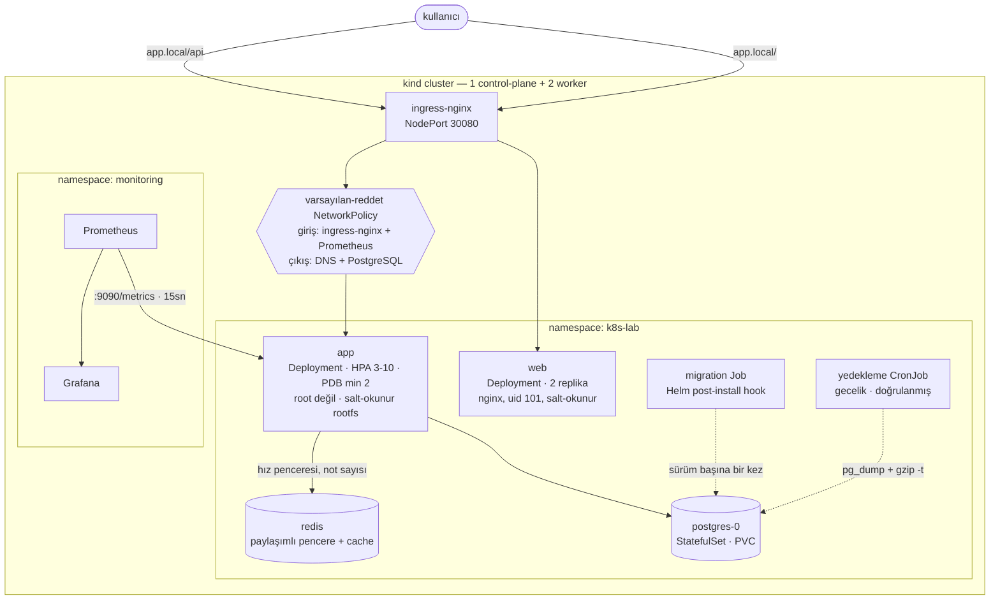

# k8s-lab

[](https://github.com/alpacino-0/k8s-lab/actions/workflows/ci.yml)
[](LICENSE)


Node.js + PostgreSQL servisi ve tarayıcı arayüzünün Kubernetes'e **üretimde
çalıştırılacağı gibi** kurulduğu proje: root olmayan konteynerler, salt-okunur dosya sistemi,
varsayılan-reddet ağ politikaları, sürüm başına bir kez çalışan şema migration'ı,
doğrulanmış gecelik yedekler, otomatik ölçekleme, kesinti bütçesi, Prometheus
metrikleri ve her push'ta gerçek bir cluster'a deploy eden CI hattı.

Buradaki her sayı, bu deponun kurduğu cluster üzerinde **ölçülmüştür**. Yol
boyunca bulunan hatalar, tek bir listede toplanmak yerine bozdukları mekanizmanın
anlatıldığı yerde yazılı. İngilizce sürüm: [README.md](README.md).

```
Kubernetes 1.36 · kind · Helm 3 · containerd · ingress-nginx · Prometheus · Grafana · GitHub Actions
```

---

## Mimari



---

## Hızlı başlangıç

Gerekenler: Docker, [kind](https://kind.sigs.k8s.io/), kubectl, Helm.

```bash
git clone https://github.com/alpacino-0/k8s-lab.git && cd k8s-lab
make up                                    # cluster + ingress + build + deploy
echo "127.0.0.1 app.local" | sudo tee -a /etc/hosts
open http://app.local:8080                 # arayüz
make smoke                                 # 35 uçtan uca kontrol
```

## Arayüz

`http://app.local:8080` çalışan bir notlar uygulaması. Aynı zamanda altında ne
olduğunun en hızlı açıklaması.

Her yanıt, onu üreten replikanın kimliğini taşıyor ve sayfa bunu bir deftere
işliyor: her istek, cevap veren pod'un şeridine bir çentik düşürüyor. Uygulamayı
birkaç saniye kullandığında yük dağılımı kendini çiziyor. Altında ise her
platform kararı, onu haklı çıkaran ölçümle birlikte anlatılıyor.

Defter Kubernetes API'sini **bilerek sorgulamıyor**. Sorgulasaydı, başka hiçbir
sebebi olmayan bir pod'a ServiceAccount token'ı bağlamak gerekirdi. Pod kimliği
bunun yerine downward API'den geliyor — kubelet'in enjekte ettiği ortam
değişkenleri — ve tarayıcı sadece geleni sayıyor.

| Komut | Ne yapar |
|---|---|
| `make test` | Birim ve entegrasyon testleri (29 test, cluster gerekmez) |
| `make lint` | ESLint + `helm lint` + tüm values profillerini üretir |
| `make deploy` | İki imajı da yeniden derler ve sürümü günceller |
| `make web` | Arayüzü yerelde, port-forward edilmiş backend'e karşı çalıştırır |
| `make smoke` | Çalışan deployment'a karşı uçtan uca kontroller |
| `make policies` | Kabul politikalarını uygular |
| `make policy-test` | Her politikanın doğru şeyi reddettiğini kanıtlar |
| `make tls` | cert-manager kurar, yerel CA ile HTTPS sunar |
| `make logging` | Loki + Alloy kurar, Loki'yi Grafana'ya bağlar |
| `make gitops` | Argo CD kurar, sürümü git'ten senkronlar |
| `make platform` | Platform katmanını Terraform ile uygular |
| `make platform-plan` | Terraform'un ne değiştireceğini gösterir, değiştirmez |
| `make monitoring` | Prometheus + Grafana kurar |
| `make down` | Cluster'ı siler |

---

## Neyi gösteriyor

### Güvenlik

| Önlem | Nerede | Nasıl doğrulandı |
|---|---|---|
| uid 1000 ile çalışır, asla root değil | `podSecurityContext.runAsNonRoot` | duman testi canlı pod'da `id -u` okur |
| Salt-okunur kök dosya sistemi | `containerSecurityContext` + `/tmp` için `emptyDir` | CI'da konteyner `--read-only` ile başlatılır |
| Tüm Linux capability'leri düşürülmüş | `capabilities.drop: [ALL]` | çalışan pod spec'i üzerinden doğrulanır |
| Yetki yükseltme kapalı, seccomp `RuntimeDefault` | pod ve konteyner security context | üretilen manifest'ler kubeconform ile denetlenir |
| ServiceAccount token'ı monte edilmez | `automountServiceAccountToken: false` | iki katman da Kubernetes API'sini kullanmaz |
| Kazıma ucu dışarıya yönlendirilmez | metrikler ayrı portta (9090) | CI `/api/metrics` için 404 doğrular |
| Arayüz CSP ve frame-deny başlıkları gönderir | `web/security-headers.conf` | çalışan konteyner üzerinde doğrulanır |
| Varsayılan-reddet ağ | 5 NetworkPolicy | yetkisiz bir pod'un erişemediği **kanıtlanır** |
| Multi-stage imaj, yalnız üretim bağımlılıkları | `app/Dockerfile` | CI'da Trivy CRITICAL/HIGH bulguda durdurur |
| npm runtime imajından çıkarıldı | `app/Dockerfile` | **tüm** Node.js paket CVE'lerini sıfırladı (aşağıda) |
| Git'te secret yok | `.gitignore` + chart values | parola zorunlu bir chart değeri |
| TLS, yönlendirme ve Secure çerez | cert-manager + açık Certificate | gerçek bir CA'nın verdiği sertifikayla her push'ta doğrulanır |
| Güvenlik ayarları zorunlu, sadece yazılı değil | Pod Security Admission + ValidatingAdmissionPolicy | 10 politika testi: iki uyumlu manifest kabul, sekiz bozuk manifest ayrı ayrı red |
| Notlar ziyaretçi başına izole | anonim çerez, owner'a göre filtrelenmiş sorgular | ikinci bir ziyaretçi ilkinin notunu ne görür ne siler |
| Yazma sınırlı | ingress `limit-rps` + paylaşımlı pencere + not tavanı | uzun ve kota aşan yazmalar reddedilir |
| Limitler replikalar arası bağlayıcı | Redis kayan pencere | limit 30 iken 60 istek: paylaşımlı **29 geçti**, replika başına **60 geçti** |
| Hiçbir şey kalıcı değil | saatlik saklama CronJob'ı | 24 saatten eski notlar silinir |

Egress politikası **DNS'e açıkça izin verir**. Bu kuralı unutmak, varsayılan-reddet
politikasının uygulamayı sessizce bozmasının en yaygın yoludur: isim çözümlemesi
başarısız olur ve her dış çağrı sebebi belli olmayan bir zaman aşımına düşer.

### Zorlama

Chart her iş yüküne özenli bir güvenlik bağlamı yazıyor. Ama yakın zamana kadar
hiçbir şey, yanına özensiz bir iş yükünün kurulmasını engellemiyordu — ayarlar
bir teamüldü, kural değil.

İkisi de Kubernetes'in içinde olan iki katman bunu kapatıyor:

- **Pod Security Admission**, namespace'te `restricted`: root yok, yetki
  yükseltme yok, capability yok, host namespace yok, hostPath yok, seccomp
  zorunlu. Buradaki her şey zaten geçiyordu — PostgreSQL ve tüm hook Job'ları dahil.
- **ValidatingAdmissionPolicy**, PSA'nın görüş bildirmediği konular için: kaynak
  istek ve limitleri, sabitlenmiş imaj etiketleri, registry beyaz listesi,
  salt-okunur kök dosya sistemi, ServiceAccount token'ı yasağı ve uzun çalışan
  her şeyde probe zorunluluğu.

Bunları açmak, ilk uygulamada bu repoda **iki gerçek açık buldu**: PostgreSQL
StatefulSet'i ServiceAccount token'ını kapatmıyordu ve migration/yedekleme
Job'larının hiçbirinde kaynak sınırı yoktu. İkisi de düzeltildi; politikalar
zaten bunları daha erken yakalayacak olan şey.

Bunlar Kyverno politikası olarak başladı ve yeniden yazıldı. Kyverno ilgili
API'yi kullanımdan kaldırmıştı ve daha önemlisi, her kural API sunucusunun
içinde çalışan yerleşik motorla ifade edilebiliyordu:

| | Kyverno | ValidatingAdmissionPolicy |
|---|---|---|
| Çalışan pod | 2 | 0 |
| Ölçülen bellek | 122 Mi | yok |
| API durumu | `ClusterPolicy` kullanımdan kalkıyor | 1.30'dan beri GA |

Politika motoru; mutasyon, namespace'ler arası üretim veya imaj imzası
doğrulaması gerektiğinde hak eder. Kyverno tam olarak bunlardan biri için geri
döndü — aşağıdaki [Tedarik zinciri](#tedarik-zinciri) ve
[policies/README.md](policies/README.md).

### Tedarik zinciri

Yukarıdaki her şey *bu iş yükü güvenli yapılandırılmış mı* sorusuna cevap verir.
Hiçbiri *bu, bizim derlediğimiz imaj mı* sorusuna cevap vermez. Sızmış bir
registry kimliği, ele geçirilmiş bir action ya da kaydırılmış bir etiket — üçü de
bu sayfadaki her politikadan geçen bir pod üretir.

Pipeline her yayımlanan imajı anahtarsız (keyless) cosign ile imzalıyor:
saklanacak, döndürülecek veya sızdırılacak bir anahtar yok. İş akışının OIDC
token'ını Fulcio'dan kısa ömürlü bir sertifikayla takas ediyor ve imzayı Rekor
şeffaflık günlüğüne yazıyor. Sonradan doğrulanan şey "birinde anahtar vardı"
değil, "bu depodaki bu iş akışı bu digest'i üretti" oluyor.

Cluster başka hiçbir şeyi kabul etmiyor. Kyverno'nun `verifyImages` kuralı,
yerleşik motorun ifade edemediği tek kural — çünkü imza doğrulamak bir registry'ye
ve bir şeffaflık günlüğüne erişmek demek, ki bir admission eklentisi bunu yapmaz.
İki pod'a mal oluyor ve Kyverno'nun kurulu olmasının tek sebebi bu:

```yaml
attestors:
  - entries:
      - keyless:
          subject: "https://github.com/alpacino-0/k8s-lab/*"
          issuer:  "https://token.actions.githubusercontent.com"
mutateDigest: true      # etiket, doğrulanan digest ile değiştirilir
```

`mutateDigest`, doğrulama ile çalıştırma arasındaki boşluğu kapatan şey. O
olmadan etiket bir kez doğrulanır, sonra çekilirken yeniden çözülür — ve bu
ikisinin aynı imaj olduğunun garantisi yoktur.

| | |
|---|---|
| İmzalı imaj | kabul, pod spec'inde `…@sha256:…` olarak yeniden yazılıyor |
| İmzalama eklenmeden önce yayımlanmış imaj | red: **`no signatures found`** |

Olumsuz durum bilinçli olarak **var olan** ama imzasız bir imaj kullanıyor. Hiç
push edilmemiş bir etiket de reddedilirdi — ama `manifest unknown` diyerek, yani
aynı rengi giymiş farklı bir hatayla.

**cosign 3 ile Kyverno henüz anlaşmıyor.** cosign 3, imzaları Sigstore bundle
(`application/vnd.dev.sigstore.bundle.v0.3+json`) olarak yazıyor ve bundan
vazgeçmenin yolu yok. Kyverno bu katmanı okuyamıyor — ve bildirdiği şey
"desteklenmeyen biçim" değil, **`no signatures found`**: doğrulayıcının
göremediği geçerli bir imza, hiç imza olmamasından ayırt edilemiyor. Bu yüzden
imzalayan taraf, doğrulayan yetişene kadar cosign 2.x'e sabitlendi. Yalnızca
imzalama action'ının yükseltilmesi zorlamayı kırmaya yetti — ve bunu yaparken
pipeline yeşil kaldı, çünkü kontrol yükseltmeden önce imzalanmış bir imajı
okuyordu.

**Bunun bulduğu hata.** Pipeline her imajın index digest'ini imzalıyordu.
Çok-mimarili bir etiket, platform başına bir manifeste işaret eden bir index'tir;
admission denetleyicisi ise etiketi kendi platformunun alt manifestine çözer ve
imzayı *o* digest'te arar — bulamaz. Sonradan doğrulandı:

```
index  sha256:dcda008f…  imzali
  ├─ linux/amd64  sha256:4ca43c01…  imzasiz
  └─ linux/arm64  sha256:a993151c…  imzasiz
```

Yani doğru imzalanmış bir imaj, doğru çalışan bir politika tarafından reddediliyordu.
CI kontrolü bunu kaçırdı ve sebebi bu tür kontrollerin genellikle kaçırma sebebi:
bir önceki adımın az önce imzaladığı digest'i doğruluyordu — var olma sebebi
yüzünden başarısız olamayacak bir test. `cosign sign --recursive` çocukları da
imzalıyor, ve kontrol artık bir cluster'ın çözebileceği her platformu doğruluyor.

### TLS

Sertifikayı cert-manager veriyor; `Certificate` kaynağını chart oluşturuyor ve
iki Ingress de ürettiği secret'ı tüketiyor.

Bunu hazırlayıp hiç çalıştırmamak kolay olurdu — herkese açık kurulum bir alan
adı ister, alan adı yok. Bu yüzden CI, yerel bir sertifika otoritesinden
**gerçek bir sertifika** aldırıyor ve tüm yolu her push'ta denetliyor:

| | |
|---|---|
| `https://…/api/healthz` | 200, sertifikayı beklenen CA vermiş |
| `http://…/api/healthz` | **308** — yönlendiriliyor, servis edilmiyor |
| `Set-Cookie` | `Secure` taşıyor |

Herkese açık bir kurulumdan tek farkı sertifikayı kimin imzaladığı. `Certificate`
kaynağı, secret, nginx TLS dinleyicisi, yönlendirme ve çerez bayrağı aynı işi
yapan aynı nesneler. Let's Encrypt'e geçiş tek değer:
`--set ingress.tls.clusterIssuer=letsencrypt-prod`.

`Certificate`'ı cert-manager'ın Ingress anotasyonu yerine chart oluşturuyor,
çünkü iki Ingress aynı host ve aynı secret'ı paylaşıyor. Anotasyonla,
cert-manager ilk Ingress'i sahip yapıyor ve ikincisi için çalışmayı reddediyor:

```
certificate resource is not owned by this object.
refusing to update non-owned certificate resource
```

Sahip Ingress silinene kadar çalışır; silindiğinde sertifika çöp toplanır ve
diğer Ingress sessizce sertifikasız kalır.

Yerelde: `make tls`, sonra `https://localhost:8443`. Tarayıcı uyarır — CA yerel
olduğu için. Gerçek olmayan tek şey o.

### Loglar

Uygulama her isteği değil, **eyleme değer olanı** logluyor:

| Sonuç | Seviye |
|---|---|
| 5xx | `error` |
| 4xx | `warn` |
| 250 ms'den yavaş 2xx | `warn`, süresiyle |
| diğer her şey | `debug`, yani üretimde kapalı |

Sağlıklı her istek için bir satır, saklaması para eden ve önemli satırları
gömen gürültüdür. Hiç log basmayan bir servis ise operatöre metriği
açıklayacak hiçbir şey bırakmaz. Bu ikisinin arası.

Beş 404, bir 400 ve altı başarılı istekten sonra ölçülen:

```
level=info    15   (başlangıç)
level=warn     5   (404'ler ve 400)
level=error    0
loglanan başarılı istek   0
```

Ve etiket şemasının varlık sebebi olan geçiş — Prometheus pod'u adlandırıyor,
Loki aynı adla sorgulanıyor:

```
promql:  topk(1, sum by (pod) (http_requests_total{status=~"4.."}))
         → app-k8s-lab-app-557bc659bb-dpp6p, 4×404 ve 1×400

logql:   {namespace="k8s-lab", pod="app-k8s-lab-app-557bc659bb-dpp6p"}
           | json | level=`warn`
         → warn request rejected POST /notes -> 400 (2.95ms)
```

`make logging` kuruyor. Loki tek-binary modda, filesystem depolamayla ve 72
saatlik saklamayla çalışıyor: dağıtık mod, nesne depolama ve cache'ler terabayt
işleyen cluster'lar için var; küçük bir cluster'da ağır bir log yığınının
başarısızlık biçimi, gözlemlemek için kurulduğu uygulamayı tahliye etmesidir.

### Dağıtım

CI ve Argo CD farklı işler yapıyor ve ayrım bilinçli: **CI bir değişikliği
sonra attığı bir cluster'da kanıtlar; Argo CD onu kalıcı olana uygular.**

Uzun ömürlü bir cluster'a `helm upgrade` çeken bir pipeline, biri gece 2'de
elle `kubectl` çalıştırana kadar doğrudur. Ondan sonra git ile cluster ayrışır
ve kimse fark etmez. [`gitops/application.yaml`](gitops/application.yaml) bunu
zorunlu bir değişmeze çeviriyor — `prune` git'ten çıkanı siler, `selfHeal`
dışarıdan değişeni geri alır.

Bu cluster'da ölçülen:

| Elle yapılan | Ne oldu |
|---|---|
| `kubectl scale --replicas=5` (git 2 diyor) | **5 saniyede** 2'ye döndü, `OutOfSync → Synced` kaydedildi |
| `kubectl delete deployment` | **5 saniyede** yeniden oluşturuldu |

Namespace, Pod Security Admission etiketlerini ve politika katılım etiketini
`managedNamespaceMetadata` üzerinden alıyor; yani GitOps ile yönetilen bir
sürüm, elle kurulan bir sürümle tam olarak aynı kurallara tabi.

**Sürüklenme olmayan kalıcı bir OutOfSync.** Application tam senkronken
`OutOfSync` görünüyordu. API sunucusu StatefulSet `volumeClaimTemplates`
alanına `apiVersion`, `kind`, `volumeMode` ve bir `status` bloğu ekliyor ve
bunların hiçbiri manifest'te yazılamaz. Sürekli kırmızı yanan bir sinyal,
herkesi GitOps'un var olma sebebi olan tek uyarıyı görmezden gelmeye alıştırır.
`volumeMode` artık açıkça yazılı ve sunucunun sahip olduğu üç alan, tüm blok
yerine jq yoluyla yok sayılıyor — yani depolama boyutundaki gerçek bir değişim
hâlâ görülüyor.

### Platform, kod olarak

`bootstrap.sh` ingress controller'ı, cert-manager'ı ve politikaları bir dizi
`kubectl` ve `helm` komutuyla kuruyordu. Çalışıyordu. Yapamadığı şey: ne
oluşturduğunu söylemek, tek bir şeyi geri almak, ve cert-manager'ın issuer'dan
önce var olması gerektiğini ifade etmek — sıralama satırların sırasına gömülüydü.

[`terraform/`](terraform/) artık o katmanı yönetiyor ve `make up` onu
tekrarlamak yerine çağırıyor. Cluster oluşturma dışarıda kalıyor: yerelde
`kind`'dan, uzakta bulut sağlayıcı veya k3s'ten geliyor — yani ikisi arasındaki
tek fark `kube_context`.

Çalışan bir cluster'ı buna taşırken iki şey ortaya çıktı; ikisi de gerçek bir
sisteme uygulamadan önce bilinmeli:

**Bir kabuk betiği ile bir Terraform yapılandırmasının aynı bileşenleri
kurması, iki doğruluk kaynağı demektir.** `bootstrap.sh`'ın statik manifestle
kurduğu sürümler hiç import edilemedi — devralınacak bir Helm sürümü yoktu,
yani Terraform yanlarına ikinci bir kopya kuracaktı. `bootstrap.sh` artık
Terraform'u çağırıyor.

**`kubernetes_manifest`, henüz var olmayan bir CRD'ye karşı plan yapamaz.**
Şemayı plan zamanında çözüyor; bu yüzden cert-manager `ClusterIssuer`'ları ve
Argo CD `Application`'ı sonradan uygulanan düz YAML olarak kalıyor. Kabul
politikalarında bu sorun yok: `ValidatingAdmissionPolicy` yerleşik bir API.

Yan kazanç: ingress NodePort'ları artık kurulumdan sonra atılan bir
`kubectl patch` değil, chart değeri. Patch çalışıyordu ama Service yeniden
oluşturulsa portları geri koyacak hiçbir şey bırakmıyordu.

### Dayanıklılık

| Davranış | Uygulama | Ölçüm |
|---|---|---|
| Liveness asla veritabanına bakmaz | `/healthz` yalnız süreç, `/readyz` DB'ye bakar | PostgreSQL sıfıra indirildiğinde: **0 restart**, pod'lar `Running` ama hazır değil; DB dönünce **8 saniyede** toparlandı |
| Düzgün kapanma | `SIGTERM` işleyicisi sunucuyu ve havuzu kapatır | pod silinmesi **30sn → 0sn** |
| Kesintisiz node bakımı | PDB + topology spread + `preStop` | `preStop` yok: **200 istekten 2'si** düştü · var: **300 istekten 0'ı** |
| Kesintisiz sürüm geçişi | `maxUnavailable: 0` + readiness | geçiş sırasında 250 istek, **0 hata** |
| Bozuk sürüme direnç | readiness kapısı | `ImagePullBackOff` yaşayan bir rollout **200 istekte 0 hata** verdi |
| Otomatik ölçekleme | CPU tabanlı HPA, asimetrik davranış | 3→10 pod **45 saniyede**; 10→2 pod **~3 dakikada** |
| Pod ölse de veri yaşar | StatefulSet + PVC | pod silindi, IP değişti, **aynı disk, aynı kayıtlar** |
| Yedekler varsayılmaz, doğrulanır | `pg_dump \| gzip` + `gzip -t` + boyut kontrolü | her kurulumda ve her gece çalışır |

Büyüme anında, küçülme kasten yavaştır: büyümede geç kalmanın bedelini kullanıcı
öder, küçülmede acele etmek zikzağa (thrashing) yol açar.

### İşletim

- **Şema migration'ları sürüm başına bir kez** çalışır — Helm `post-install,post-upgrade`
  hook Job'u olarak. Init container'da olsaydı eşzamanlı replikalar DDL kilitlerinde yarışırdı.
- **Config değişince pod'lar yenilenir** — `checksum/config` anotasyonu sayesinde.
  Olmasaydı ConfigMap güncellenir ama çalışan konteynerler eski değeri kullanmaya devam ederdi.
- **Loglar toplanıyor ve sorgulanabiliyor**, sadece yapılandırılmış değil. Loki
  saklıyor, Grafana Alloy taşıyor ve etiketler Prometheus metriklerindekiyle
  aynı adlarda — yani panodaki bir sıçrama ile arkasındaki satırlar tek etiket
  uzaklıkta. Promtail bariz seçim olurdu; Mart 2026'da desteği bitti, bu yüzden
  Alloy kullanılıyor.
- **Uygulama metrikleri**, sadece altyapı metrikleri değil: `http_requests_total`,
  `http_request_duration_seconds`, `notes_total`, `database_up`.
- **Gerçekten ateşleyen alarmlar.** `up == 0`, tüm hedefler yok olduğunda ateşlemez;
  çünkü seri de yok olur. Aynı koşullarda yan yana ölçüldü:

  ```
  up{job="app"} == 0        → inactive   (hiç ateşlemez)
  absent(up{job="app"})     → firing     (doğrusu)
  ```

### CI/CD

Her push'ta beş job ([`.github/workflows/ci.yml`](.github/workflows/ci.yml)):

| Job | Neyi denetler |
|---|---|
| `test` | API için ESLint + 29 test; arayüz için ESLint + üretim derlemesi |
| `manifests` | `helm lint`, values profilleri, kubeconform şema denetimi, `terraform fmt -check` ve `validate`, iki Dockerfile için hadolint |
| `image` | İki imajı derler, ikisinin de root olmadığını doğrular, salt-okunur başlatır, Trivy taraması |
| `e2e` | Gerçek kind cluster kurar, politikaları **chart'tan önce** uygular (yani sürüm onlara uymak zorunda), 10 politika kontrolünü ve 35 duman kontrolünü çalıştırır, ardından bir upgrade'in **sıfır istek düşürdüğünü** kanıtlar |
| `publish` | İki imajı da amd64 + arm64 için GHCR'a, SBOM ve provenance ile push eder (yalnız main) |

---

## Dizin yapısı

```
app/                  Node.js servisi
  src/                config · logger · metrics · db · app · index
  test/               birim ve entegrasyon testleri (node:test, framework yok)
  Dockerfile          multi-stage, sabit sürüm, root değil
web/                  React arayüzü (Vite), yetkisiz nginx ile servis edilir
  src/                app · pod defteri · notlar · mekanizmalar
  nginx.conf          SPA fallback, CSP, yazma işlemleri /tmp ile sınırlı
chart/                Helm chart — tek deploy yolu
  templates/          19 kaynak şablonu + helper'lar
  values.yaml         açıklamalı varsayılanlar
  values-dev.yaml     minimum ayak izi, demo uçları açık
  values-prod.yaml    otomatik ölçekleme, yedekleme, izleme, ağ politikaları
  values-public.yaml  GHCR imajları, TLS, harici secret — herkese açık adres için
terraform/            platform katmanı: ingress, cert-manager, Argo CD, politikalar
gitops/               Argo CD Application'ları: sürüm ve operator
cluster/              cluster kapsamlı eklentiler, chart'ın dışında
  issuers.yaml        yerel CA — TLS yolu varsayılmıyor, çalıştırılıyor
  loki-values.yaml    tek-binary Loki, filesystem depolama, 72 saat saklama
  alloy-values.yaml   log toplayıcı, metriklerle aynı etiketlerle
  argocd-values.yaml  Dex, bildirim ve ApplicationSet olmadan Argo CD
policies/             cluster politikası, bilerek chart'ın dışında
  namespace.yaml      Pod Security Admission etiketleri
  admission-*.yaml    ValidatingAdmissionPolicy kuralları ve bağlamaları
scripts/
  bootstrap.sh        idempotent cluster + ingress + politikalar + deploy
  policy-test.sh      her kuralın doğru şeyi reddettiğini kanıtlayan 12 kontrol
  smoke-test.sh       güvenlik duruşu ve izolasyon dahil 35 uçtan uca kontrol
  teardown.sh         cluster'ı siler
```

---

### Saldırı yüzeyini küçültmek

İlk Trivy taraması yaklaşık otuz CRITICAL/HIGH bulgu verdi. Neredeyse hiçbiri
uygulamanın kendi bağımlılıklarından değildi — **npm**'den geliyorlardı. Temel
imaj npm'i taşıyor, ama çalışma anında hiç kullanılmıyor: giriş noktası
`node src/index.js`. npm ve bağımlılık ağacı (`tar`, `minimatch`, `glob`,
`sigstore`, ...) derleme zamanı araçları, üretime gönderilmemeliydi.

```dockerfile
RUN apk upgrade --no-cache
RUN rm -rf /usr/local/lib/node_modules/npm /usr/local/bin/npm /usr/local/bin/npx \
           /opt/yarn-* /usr/local/bin/yarn /usr/local/bin/yarnpkg
```

| | Öncesi | Sonrası |
|---|---|---|
| Node.js paket bulgusu | ~20 HIGH, 1 CRITICAL | **0** |
| OS paket bulgusu | 11 HIGH/CRITICAL | **0** |
| İmaj boyutu | 205 MB | 206 MB |

Temel imajı sabitlemek build'leri tekrarlanabilir tutar; `apk upgrade` yamalı tutar.

## Bu projenin bulduğu hatalar

İkisi de bilerek bir şeyleri bozarak bulundu ve ikisi de yalnızca arıza anında
ortaya çıkan türden.

**Veritabanı her yeniden başladığında uygulama çöküyordu.** `node-postgres`,
boştaki bir bağlantı koparıldığında `Pool` üzerinde bir `error` olayı yayar.
Dinleyicisi yoksa Node bunu yakalanmamış `'error'` olayı sayar ve süreci öldürür.
PostgreSQL sıfıra indirildiğinde üç replikanın üçü birden düştü:

```
node:events:502  throw er; // Unhandled 'error' event
error: terminating connection due to administrator command
```

Tek bir dinleyici sorunu çözdü. Aynı test sonrasında **0 restart** verdi —
readiness pod'ları Service'ten çıkardı, liveness onlara dokunmadı.

**`helm --wait` sağlıklı bir cluster'da sonsuza kadar bekledi.** Yedekleme PVC'si
`WaitForFirstConsumer` modundaki bir StorageClass kullanıyor; yani onu bir şey
mount edene kadar `Pending` kalıyor — ve tek kullanıcısı gece 02:00'ye planlanmış
CronJob'du. Çözüm iki parçalı: tüm sürüm yerine gerçekten önemli iş yüklerini
beklemek, ve kurulum sırasında bir kez doğrulanmış yedek almak — bu hem yedekleme
yolunun çalıştığını kanıtlar hem de volume'ü bağlar.

---

### Trafiği okurken çıkan bir diğeri

Arayüzü bağlamak, manifest'lerin iddia ettiği ama hiç uygulamadığı bir açığı
ortaya çıkardı: ingress `/api`'yi servise yönlendiriyordu ve `/metrics` aynı
portta duruyordu — yani ham Prometheus kazıma ucu dışarıdan erişilebilirdi.
Çözüm bir ingress kuralı değil, ikinci bir dinleyici oldu: telemetri artık 9090
portunda, dışarıdan hiçbir yönlendirme almıyor ve ağ politikası o portu yalnızca
Prometheus'a açıyor. CI `/api/metrics` için 404 bekliyor.

Aynı oturumda iki küçük hata daha çıktı: nginx, bir alt blok kendi `add_header`
direktifini koyar koymaz miras alınan **tüm** başlıkları sessizce düşürüyor —
güvenlik başlıkları hiç gönderilmiyordu. Ve arayüzün Service'i, API'nin
`app.kubernetes.io/name` etiketini taşıdığı için Prometheus nginx'ten `/metrics`
kazımaya çalışıyordu.

## Herkese açık bir adrese hazır

Demo, yabancıların erişebileceği bir URL'e konabilir. Bunun için gerekenler ve
sebepleri:

**Herkes kullanabilir ama kimse aynı tabloyu paylaşmaz.** Giriş zorunlu olsaydı
kimse demoyu denemezdi; ortak ve sınırsız bir tablo ise link paylaşıldıktan
birkaç saat sonra spam duvarına döner. Notlar bunun yerine anonim bir ziyaretçi
çerezine bağlı — kayıt yok, ve her sorgu sahibe göre filtreleniyor. CI'da
doğrulanıyor: ikinci bir ziyaretçi ilkinin notunu ne okuyabiliyor ne silebiliyor.

**Yazma üç katmanda sınırlı.** Ingress her istemci IP'sini sınırlıyor (`25r/s`,
burst 125, 20 eşzamanlı bağlantı). Uygulama, ziyaretçi başına sayımı bütün
replikaların paylaştığı bir Redis kayan penceresinde yapıyor. Ve her ziyaretçi
aynı anda 20 not tutabiliyor; depolama büyümesini durduran bu.

Paylaşımlı pencere, süreç içi olanın sessizce bozuk olması yüzünden eklendi. Üç
replika ayrı ayrı sayıyordu, yani istemci hakkının üç katını alıyordu — kod bunu
bir yorumda itiraf ediyordu ama hiçbir test doğrulamıyordu. Ölçüm, dakikada 30
limitine karşı 60 istek:

| | Geçen | Reddedilen |
|---|---|---|
| Replika başına sayaç | **60** | 0 |
| Paylaşımlı pencere | **29** | 31 |

CI artık bu karşılaştırmayı her push'ta çalıştırıyor. Redis opsiyonel: erişilemez
olduğunda servis çökmüyor, replika başına sayıma ve soğuk cache'e düşüyor —
çalışan bir deployment'tan Redis adresi silinerek doğrulandı; istekler
karşılanmaya devam etti, yalnızca limit gevşedi.

**Hiçbir şey kalıcı değil.** Saatlik bir CronJob 24 saatten eski notları siliyor.
Owner sütunu eklenmeden önce yazılmış satırlar bir sentinel sahiple işaretli:
kimseye görünmüyorlar ve aynı iş tarafından temizleniyorlar.

**Metin temizleniyor, güvenilmiyor.** Kontrol karakterleri ayıklanıyor, uzunluk
500 karakterle, JSON gövdesi 32kb ile sınırlı; arayüz metni metin olarak basıyor.

**Yayına almak için gereken her şey hazır, ama kullanılmıyor.**
`chart/values-public.yaml` yayınlanmış GHCR imajlarını gösteriyor, cert-manager
ile TLS'i açıyor, ziyaretçi çerezini `Secure` işaretliyor ve veritabanı
parolasını chart dışında oluşturulmuş bir secret'tan alıyor — yani parola ne bir
dosyaya ne kabuk geçmişine giriyor.
[docs/DEPLOY.md](docs/DEPLOY.md) adım adım kılavuz: küçük bir VPS'te k3s,
ingress-nginx, cert-manager, tek `helm upgrade`.
Bu yol, aynı profil GHCR'dan geçici bir namespace'e kurularak doğrulandı —
31/31 kontrol — yani geriye kalan bir sunucu ve bir alan adı, bilinmeyen değil.

Ürün olması için hâlâ eksik olanlar: cluster dışı yedekler ve gece uyandırılacak
bir sorumlu.

## Bilinen sınırlar

Bu proje yerel bir kind cluster'ında çalışır. TLS, admission zorlaması ve imza
doğrulaması gerçek ve her push'ta sınanıyor — onlar bu listede değil. Hâlâ eksik
olanlar:

- **Secret'lar düz Kubernetes Secret'ı** — base64, şifreleme değil. Üretimde harici
  secret yönetimi ve etcd'de şifreleme gerekir. Bu, aksi halde eksiksiz olan
  GitOps zincirindeki tek kopuk halka: cluster'daki diğer her şey bu depodan
  yeniden üretilebilir, secret'lar üretilemez.
- **PostgreSQL tek replika**, failover yok; yedekler aynı cluster'daki bir PVC'ye
  yazılıyor. Yedekler doğrulanıyor — her kurulumda ve her gece `gzip -t` ve bir
  boyut tabanı — ama kaynağıyla aynı arıza alanını paylaşan bir yedek, yedek
  değildir. Gerçek olanlar cluster dışında, nesne depolamada durmalı.
- **metrics-server platform katmanında değil.** Elle kuruldu; yani yukarıda
  ölçülen otomatik ölçekleme bu cluster'da yaşıyor ama cluster yeniden
  kurulduğunda yaşamaz. `make up`'ın yarattığı diğer her şey Terraform'dan geliyor.
- **Alertmanager kapalı.** `PrometheusRule` var ve ifadeleri gerçekten ateşlenerek
  test edildi; ürettiklerini teslim edecek hiçbir şey bağlı değil.
- **ResourceQuota veya LimitRange yok.** Tek tek iş yükleri admission politikasıyla
  sınırlanıyor; namespace'in bütünü için bir tavan yok.
- **Dağıtık izleme (tracing) yok.** Yalnızca metrik ve log var.

---

## Lisans

MIT — [LICENSE](LICENSE).
