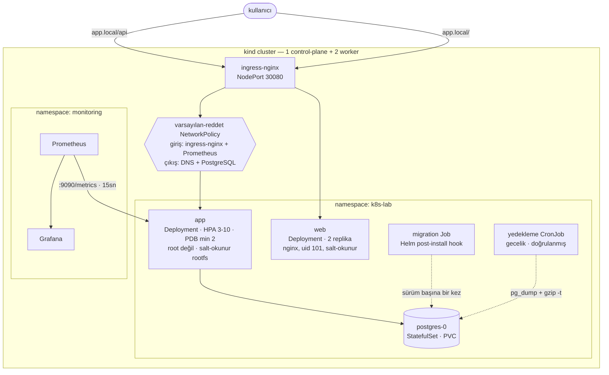

# k8s-lab

[](https://github.com/alpacino-0/k8s-lab/actions/workflows/ci.yml)
[](LICENSE)


Node.js + PostgreSQL servisi ve tarayıcı arayüzünün Kubernetes'e **üretimde
çalıştırılacağı gibi** kurulduğu proje: root olmayan konteynerler, salt-okunur dosya sistemi,
varsayılan-reddet ağ politikaları, sürüm başına bir kez çalışan şema migration'ı,
doğrulanmış gecelik yedekler, otomatik ölçekleme, kesinti bütçesi, Prometheus
metrikleri ve her push'ta gerçek bir cluster'a deploy eden CI hattı.

Buradaki her sayı, bu deponun kurduğu cluster üzerinde **ölçülmüştür**. Yol
boyunca bulunan hatalar dahil tüm kayıt: [docs/LEARNING-LOG.tr.md](docs/LEARNING-LOG.tr.md).
İngilizce sürüm: [README.md](README.md).

```
Kubernetes 1.36 · kind · Helm 3 · containerd · ingress-nginx · Prometheus · Grafana · GitHub Actions
```

---

## Mimari



---

## Hızlı başlangıç

Gerekenler: Docker, [kind](https://kind.sigs.k8s.io/), kubectl, Helm.

```bash
git clone https://github.com/alpacino-0/k8s-lab.git && cd k8s-lab
make up                                    # cluster + ingress + build + deploy
echo "127.0.0.1 app.local" | sudo tee -a /etc/hosts
open http://app.local:8080                 # arayüz
make smoke                                 # 31 uçtan uca kontrol
```

## Arayüz

`http://app.local:8080` çalışan bir notlar uygulaması. Aynı zamanda altında ne
olduğunun en hızlı açıklaması.

Her yanıt, onu üreten replikanın kimliğini taşıyor ve sayfa bunu bir deftere
işliyor: her istek, cevap veren pod'un şeridine bir çentik düşürüyor. Uygulamayı
birkaç saniye kullandığında yük dağılımı kendini çiziyor. Altında ise her
platform kararı, onu haklı çıkaran ölçümle birlikte anlatılıyor.

Defter Kubernetes API'sini **bilerek sorgulamıyor**. Sorgulasaydı, başka hiçbir
sebebi olmayan bir pod'a ServiceAccount token'ı bağlamak gerekirdi. Pod kimliği
bunun yerine downward API'den geliyor — kubelet'in enjekte ettiği ortam
değişkenleri — ve tarayıcı sadece geleni sayıyor.

| Komut | Ne yapar |
|---|---|
| `make test` | Birim ve entegrasyon testleri (24 test, cluster gerekmez) |
| `make lint` | ESLint + `helm lint` + tüm values profillerini üretir |
| `make deploy` | İki imajı da yeniden derler ve sürümü günceller |
| `make web` | Arayüzü yerelde, port-forward edilmiş backend'e karşı çalıştırır |
| `make smoke` | Çalışan deployment'a karşı uçtan uca kontroller |
| `make monitoring` | Prometheus + Grafana kurar |
| `make down` | Cluster'ı siler |

---

## Neyi gösteriyor

### Güvenlik

| Önlem | Nerede | Nasıl doğrulandı |
|---|---|---|
| uid 1000 ile çalışır, asla root değil | `podSecurityContext.runAsNonRoot` | duman testi canlı pod'da `id -u` okur |
| Salt-okunur kök dosya sistemi | `containerSecurityContext` + `/tmp` için `emptyDir` | CI'da konteyner `--read-only` ile başlatılır |
| Tüm Linux capability'leri düşürülmüş | `capabilities.drop: [ALL]` | çalışan pod spec'i üzerinden doğrulanır |
| Yetki yükseltme kapalı, seccomp `RuntimeDefault` | pod ve konteyner security context | üretilen manifest'ler kubeconform ile denetlenir |
| ServiceAccount token'ı monte edilmez | `automountServiceAccountToken: false` | iki katman da Kubernetes API'sini kullanmaz |
| Kazıma ucu dışarıya yönlendirilmez | metrikler ayrı portta (9090) | CI `/api/metrics` için 404 doğrular |
| Arayüz CSP ve frame-deny başlıkları gönderir | `web/security-headers.conf` | çalışan konteyner üzerinde doğrulanır |
| Varsayılan-reddet ağ | 3 NetworkPolicy | yetkisiz bir pod'un erişemediği **kanıtlanır** |
| Multi-stage imaj, yalnız üretim bağımlılıkları | `app/Dockerfile` | CI'da Trivy CRITICAL/HIGH bulguda durdurur |
| npm runtime imajından çıkarıldı | `app/Dockerfile` | **tüm** Node.js paket CVE'lerini sıfırladı (aşağıda) |
| Git'te secret yok | `.gitignore` + chart values | parola zorunlu bir chart değeri |
| Notlar ziyaretçi başına izole | anonim çerez, owner'a göre filtrelenmiş sorgular | ikinci bir ziyaretçi ilkinin notunu ne görür ne siler |
| Yazma sınırlı | ingress `limit-rps` + ziyaretçi sayaçları + not tavanı | uzun ve kota aşan yazmalar reddedilir |
| Hiçbir şey kalıcı değil | saatlik saklama CronJob'ı | 24 saatten eski notlar silinir |

Egress politikası **DNS'e açıkça izin verir**. Bu kuralı unutmak, varsayılan-reddet
politikasının uygulamayı sessizce bozmasının en yaygın yoludur: isim çözümlemesi
başarısız olur ve her dış çağrı sebebi belli olmayan bir zaman aşımına düşer.

### Dayanıklılık

| Davranış | Uygulama | Ölçüm |
|---|---|---|
| Liveness asla veritabanına bakmaz | `/healthz` yalnız süreç, `/readyz` DB'ye bakar | PostgreSQL sıfıra indirildiğinde: **0 restart**, pod'lar `Running` ama hazır değil; DB dönünce **8 saniyede** toparlandı |
| Düzgün kapanma | `SIGTERM` işleyicisi sunucuyu ve havuzu kapatır | pod silinmesi **30sn → 0sn** |
| Kesintisiz node bakımı | PDB + topology spread + `preStop` | `preStop` yok: **200 istekten 2'si** düştü · var: **300 istekten 0'ı** |
| Kesintisiz sürüm geçişi | `maxUnavailable: 0` + readiness | geçiş sırasında 250 istek, **0 hata** |
| Bozuk sürüme direnç | readiness kapısı | `ImagePullBackOff` yaşayan bir rollout **200 istekte 0 hata** verdi |
| Otomatik ölçekleme | CPU tabanlı HPA, asimetrik davranış | 3→10 pod **45 saniyede**; 10→2 pod **~3 dakikada** |
| Pod ölse de veri yaşar | StatefulSet + PVC | pod silindi, IP değişti, **aynı disk, aynı kayıtlar** |
| Yedekler varsayılmaz, doğrulanır | `pg_dump \| gzip` + `gzip -t` + boyut kontrolü | her kurulumda ve her gece çalışır |

Büyüme anında, küçülme kasten yavaştır: büyümede geç kalmanın bedelini kullanıcı
öder, küçülmede acele etmek zikzağa (thrashing) yol açar.

### İşletim

- **Şema migration'ları sürüm başına bir kez** çalışır — Helm `post-install,post-upgrade`
  hook Job'u olarak. Init container'da olsaydı eşzamanlı replikalar DDL kilitlerinde yarışırdı.
- **Config değişince pod'lar yenilenir** — `checksum/config` anotasyonu sayesinde.
  Olmasaydı ConfigMap güncellenir ama çalışan konteynerler eski değeri kullanmaya devam ederdi.
- **Yapılandırılmış JSON loglar**, satır başına bir nesne; her log toplayıcı doğrudan ayrıştırır.
- **Uygulama metrikleri**, sadece altyapı metrikleri değil: `http_requests_total`,
  `http_request_duration_seconds`, `notes_total`, `database_up`.
- **Gerçekten ateşleyen alarmlar.** `up == 0`, tüm hedefler yok olduğunda ateşlemez;
  çünkü seri de yok olur. Aynı koşullarda yan yana ölçüldü:

  ```
  up{job="app"} == 0        → inactive   (hiç ateşlemez)
  absent(up{job="app"})     → firing     (doğrusu)
  ```

### CI/CD

Her push'ta beş job ([`.github/workflows/ci.yml`](.github/workflows/ci.yml)):

| Job | Neyi denetler |
|---|---|
| `test` | API için ESLint + 24 test; arayüz için ESLint + üretim derlemesi |
| `manifests` | `helm lint`, üç values profili, kubeconform şema denetimi, iki Dockerfile için hadolint |
| `image` | İki imajı derler, ikisinin de root olmadığını doğrular, salt-okunur başlatır, Trivy taraması |
| `e2e` | Gerçek kind cluster kurar, chart'ı yükler, iki ingress yolunu da denetler, 31 kontrolü çalıştırır, ardından bir upgrade'in **sıfır istek düşürdüğünü** kanıtlar |
| `publish` | İki imajı da amd64 + arm64 için GHCR'a, SBOM ve provenance ile push eder (yalnız main) |

---

## Dizin yapısı

```
app/                  Node.js servisi
  src/                config · logger · metrics · db · app · index
  test/               birim ve entegrasyon testleri (node:test, framework yok)
  Dockerfile          multi-stage, sabit sürüm, root değil
web/                  React arayüzü (Vite), yetkisiz nginx ile servis edilir
  src/                app · pod defteri · notlar · mekanizmalar
  nginx.conf          SPA fallback, CSP, yazma işlemleri /tmp ile sınırlı
chart/                Helm chart — tek deploy yolu
  templates/          17 kaynak şablonu + helper'lar
  values.yaml         açıklamalı varsayılanlar
  values-dev.yaml     minimum ayak izi, demo uçları açık
  values-prod.yaml    otomatik ölçekleme, yedekleme, izleme, ağ politikaları
  values-public.yaml  GHCR imajları, TLS, harici secret — herkese açık adres için
scripts/
  bootstrap.sh        idempotent cluster + ingress + deploy
  smoke-test.sh       güvenlik duruşu dahil 31 uçtan uca kontrol
  teardown.sh         cluster'ı siler
docs/
  DEPLOY.md           herkese açık bir adrese alma kılavuzu
  LEARNING-LOG.tr.md  ölçümler ve bulunan hatalar
```

---

### Saldırı yüzeyini küçültmek

İlk Trivy taraması yaklaşık otuz CRITICAL/HIGH bulgu verdi. Neredeyse hiçbiri
uygulamanın kendi bağımlılıklarından değildi — **npm**'den geliyorlardı. Temel
imaj npm'i taşıyor, ama çalışma anında hiç kullanılmıyor: giriş noktası
`node src/index.js`. npm ve bağımlılık ağacı (`tar`, `minimatch`, `glob`,
`sigstore`, ...) derleme zamanı araçları, üretime gönderilmemeliydi.

```dockerfile
RUN apk upgrade --no-cache
RUN rm -rf /usr/local/lib/node_modules/npm /usr/local/bin/npm /usr/local/bin/npx \
           /opt/yarn-* /usr/local/bin/yarn /usr/local/bin/yarnpkg
```

| | Öncesi | Sonrası |
|---|---|---|
| Node.js paket bulgusu | ~20 HIGH, 1 CRITICAL | **0** |
| OS paket bulgusu | 11 HIGH/CRITICAL | **0** |
| İmaj boyutu | 205 MB | 206 MB |

Temel imajı sabitlemek build'leri tekrarlanabilir tutar; `apk upgrade` yamalı tutar.

## Bu projenin bulduğu iki hata

İkisi de bilerek bir şeyleri bozarak bulundu ve ikisi de yalnızca arıza anında
ortaya çıkan türden.

**Veritabanı her yeniden başladığında uygulama çöküyordu.** `node-postgres`,
boştaki bir bağlantı koparıldığında `Pool` üzerinde bir `error` olayı yayar.
Dinleyicisi yoksa Node bunu yakalanmamış `'error'` olayı sayar ve süreci öldürür.
PostgreSQL sıfıra indirildiğinde üç replikanın üçü birden düştü:

```
node:events:502  throw er; // Unhandled 'error' event
error: terminating connection due to administrator command
```

Tek bir dinleyici sorunu çözdü. Aynı test sonrasında **0 restart** verdi —
readiness pod'ları Service'ten çıkardı, liveness onlara dokunmadı.

**`helm --wait` sağlıklı bir cluster'da sonsuza kadar bekledi.** Yedekleme PVC'si
`WaitForFirstConsumer` modundaki bir StorageClass kullanıyor; yani onu bir şey
mount edene kadar `Pending` kalıyor — ve tek kullanıcısı gece 02:00'ye planlanmış
CronJob'du. Çözüm iki parçalı: tüm sürüm yerine gerçekten önemli iş yüklerini
beklemek, ve kurulum sırasında bir kez doğrulanmış yedek almak — bu hem yedekleme
yolunun çalıştığını kanıtlar hem de volume'ü bağlar.

---

### Trafiği okurken çıkan dördüncü hata

Arayüzü bağlamak, manifest'lerin iddia ettiği ama hiç uygulamadığı bir açığı
ortaya çıkardı: ingress `/api`'yi servise yönlendiriyordu ve `/metrics` aynı
portta duruyordu — yani ham Prometheus kazıma ucu dışarıdan erişilebilirdi.
Çözüm bir ingress kuralı değil, ikinci bir dinleyici oldu: telemetri artık 9090
portunda, dışarıdan hiçbir yönlendirme almıyor ve ağ politikası o portu yalnızca
Prometheus'a açıyor. CI `/api/metrics` için 404 bekliyor.

Aynı oturumda iki küçük hata daha çıktı: nginx, bir alt blok kendi `add_header`
direktifini koyar koymaz miras alınan **tüm** başlıkları sessizce düşürüyor —
güvenlik başlıkları hiç gönderilmiyordu. Ve arayüzün Service'i, API'nin
`app.kubernetes.io/name` etiketini taşıdığı için Prometheus nginx'ten `/metrics`
kazımaya çalışıyordu.

## Herkese açık bir adrese hazır

Demo, yabancıların erişebileceği bir URL'e konabilir. Bunun için gerekenler ve
sebepleri:

**Herkes kullanabilir ama kimse aynı tabloyu paylaşmaz.** Giriş zorunlu olsaydı
kimse demoyu denemezdi; ortak ve sınırsız bir tablo ise link paylaşıldıktan
birkaç saat sonra spam duvarına döner. Notlar bunun yerine anonim bir ziyaretçi
çerezine bağlı — kayıt yok, ve her sorgu sahibe göre filtreleniyor. CI'da
doğrulanıyor: ikinci bir ziyaretçi ilkinin notunu ne okuyabiliyor ne silebiliyor.

**Yazma üç katmanda sınırlı.** Ingress her istemci IP'sini sınırlıyor (`25r/s`,
burst 125, 20 eşzamanlı bağlantı). Uygulama kendi ziyaretçi sayaçlarını yedek
olarak tutuyor — bilerek replika başına, yani asıl bağlayıcı sınır ingress'te.
Ve her ziyaretçi aynı anda 20 not tutabiliyor; depolama büyümesini durduran bu.

**Hiçbir şey kalıcı değil.** Saatlik bir CronJob 24 saatten eski notları siliyor.
Owner sütunu eklenmeden önce yazılmış satırlar bir sentinel sahiple işaretli:
kimseye görünmüyorlar ve aynı iş tarafından temizleniyorlar.

**Metin temizleniyor, güvenilmiyor.** Kontrol karakterleri ayıklanıyor, uzunluk
500 karakterle, JSON gövdesi 32kb ile sınırlı; arayüz metni metin olarak basıyor.

**Yayına almak için gereken her şey hazır, ama kullanılmıyor.**
`chart/values-public.yaml` yayınlanmış GHCR imajlarını gösteriyor, cert-manager
ile TLS'i açıyor, ziyaretçi çerezini `Secure` işaretliyor ve veritabanı
parolasını chart dışında oluşturulmuş bir secret'tan alıyor — yani parola ne bir
dosyaya ne kabuk geçmişine giriyor. [docs/DEPLOY.md](docs/DEPLOY.md) adım adım
kılavuz: küçük bir VPS'te k3s, ingress-nginx, cert-manager, tek `helm upgrade`.
Bu yol, aynı profil GHCR'dan geçici bir namespace'e kurularak doğrulandı —
31/31 kontrol — yani geriye kalan bir sunucu ve bir alan adı, bilinmeyen değil.

Ürün olması için hâlâ eksik olanlar: cluster dışı yedekler ve gece uyandırılacak
bir sorumlu.

## Bilinen sınırlar

Bu proje yerel bir kind cluster'ında çalışır. Gerçek trafik taşıyabilmesi için:

- **TLS yok.** Chart `ingress.tls` destekliyor ama sertifika üretmek cert-manager
  ve gerçek bir alan adı gerektirir.
- **Secret'lar düz Kubernetes Secret'ı** — base64, şifreleme değil. Üretimde harici
  secret yönetimi ve etcd'de şifreleme gerekir.
- **PostgreSQL tek replika**, failover yok; yedekler aynı cluster'daki bir PVC'ye
  yazılıyor. Gerçek yedekler cluster dışında, nesne depolamada durmalı.
- **PodSecurity admission veya OPA/Kyverno yok** — chart güvenlik ayarlarını
  koyuyor ama hatalı bir deployment'ı engelleyen bir mekanizma yok.
- **Dağıtık izleme (tracing) yok.** Yalnızca metrik ve log var.

---

## Lisans

MIT — [LICENSE](LICENSE).
